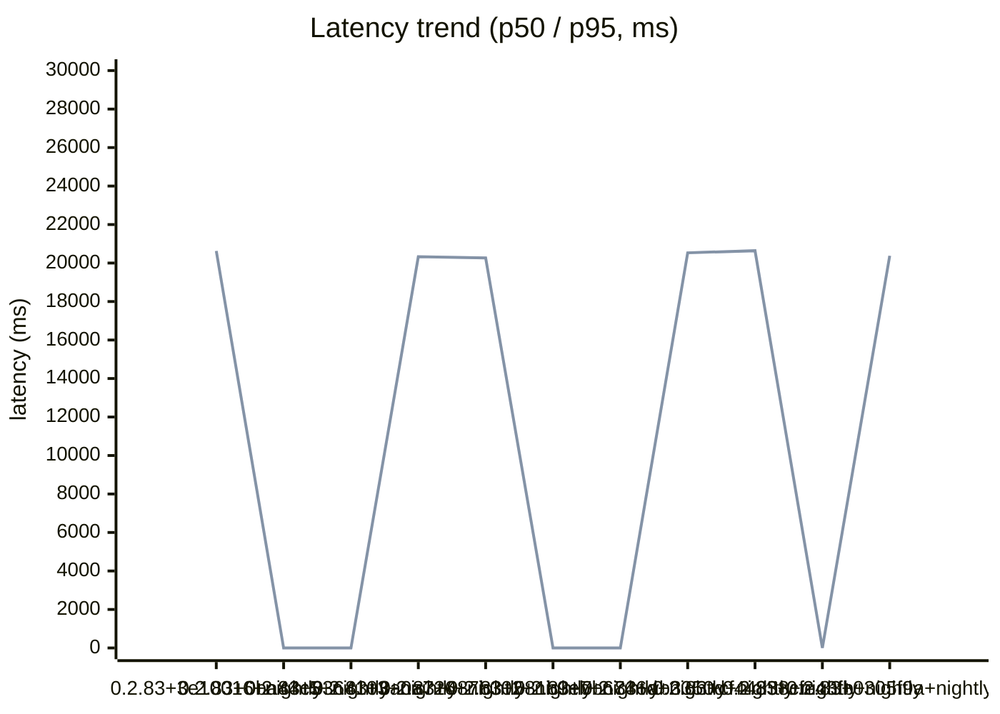

# gtm Benchmarks

Automated measurements of gtm's resource usage during playback, compared
release-over-release and against the reference CLI player **cliamp**
([bjarneo/cliamp](https://github.com/bjarneo/cliamp)).

> **This run**: release `0.2.83+3e10016+nightly` (commit `3e100168e456d29fee2c3cabd7616ff28e646a80`, 2026-09-12T13:00:32Z).

## Headline — diff vs the last published release (`0.2.83+0ba44c5+nightly`)

| Fixture (player) | Metric | Prev (`0.2.83+0ba44c5+nightly`) | This | Δ |
|------------------|--------|------:|-----:|---:|
| bench.flac (gtm) | peak RSS (kB) | 19512 | 20628 | **+1116** |
| bench.flac (gtm) | mean RSS (kB) | 19469 | 20593 | **+1124** |
| bench.flac (gtm) | CPU (ms) | 110 | 90 | **−20** |
| bench.flac (gtm) | RSS @5s (kB) | 19384 | 20524 | **+1140** |
| bench.mp3 (gtm) | peak RSS (kB) | 19540 | 20764 | **+1224** |
| bench.mp3 (gtm) | mean RSS (kB) | 19522 | 20746 | **+1224** |
| bench.mp3 (gtm) | CPU (ms) | 210 | 150 | **−60** |
| bench.mp3 (gtm) | RSS @5s (kB) | 19432 | 20660 | **+1228** |

## Peak RSS by release (gtm vs cliamp, kB)

```mermaid
xychart-beta
  title "Peak RSS by release (gtm vs cliamp, kB)"
  x-axis ["prev", "this"]
  y-axis "peak RSS (kB)" 0 --> 120000
  bar [19512, 20628]
  bar [19540, 20764]
```

## Mean RSS trend across releases (gtm, kB)

## Latency trend across releases (p50 / p95, ms)

## History

| Release | Date | gtm peak RSS (kB) (FLAC) |
|---------|------|-----:|
| 0.2.83+3e10016+nightly | 2026-09-12 | 20628 |
| 0.2.83+0ba44c5+nightly | 2026-09-09 | 19512 |
| 0.2.83+3364103+nightly | 2026-09-08 | 19860 |
| 0.2.83+3a0a726+nightly | 2026-09-11 | 20328 |
| 0.2.83+487b302+nightly | 2026-09-11 | 20268 |
| 0.2.83+581b9eb+nightly | 2026-09-09 | 20140 |
| 0.2.83+7b6746d+nightly | 2026-09-10 | 20036 |
| 0.2.83+ab3350d+nightly | 2026-09-10 | 20532 |
| 0.2.83+cf44858+nightly | 2026-09-10 | 20640 |
| 0.2.83+cfe43fb+nightly | 2026-09-08 | 19492 |
| 0.2.83+0305f9a+nightly | 2026-09-10 | 20376 |

## Methodology

- A single representative FLAC and one MP3 (both committed under a sealed
  fixture hash — see `bench-results/fixtures/` and `gen-fixtures.sh -c`) are
  played for the same window for gtm and cliamp.
- gtm runs through its headless daemon in `--test-mode` (NullMixer, no audio
  device) so CPU/RSS are measured without an audio sink.
- Metrics: peak / mean / at-5s RSS (kB, from `/proc/<pid>/status` `VmRSS`),
  CPU (ms, from `/proc/<pid>/stat` utime+stime), and t_ready (ms, IPC round
  trip to first playing state — informational only).
- Harness: `scripts/bench/run-bench.sh <player> <file> <seconds>`; collection:
  `scripts/bench/collect.sh <tag>`; this renderer: `scripts/bench/render-bench.sh`.
