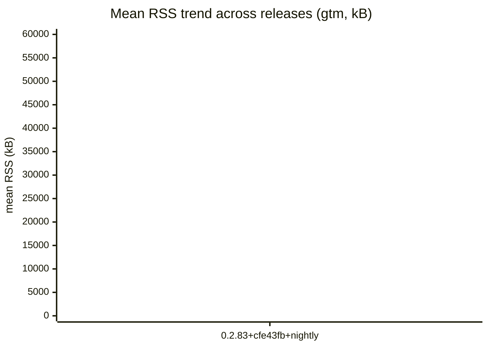

# gtm Benchmarks

Automated measurements of gtm's resource usage during playback, compared
release-over-release and against the reference CLI player **cliamp**
([bjarneo/cliamp](https://github.com/bjarneo/cliamp)).

> **This run**: release `0.2.83+cfe43fb+nightly` (commit `cfe43fbf581ce65bd900879a5883f49d610243e0`, 2026-09-08T17:55:34Z).

## Headline — diff vs the last published release (none yet)

| Fixture (player) | Metric | Prev | This | Δ |
|------------------|--------|------:|-----:|---:|
| bench.flac (gtm) | peak RSS (kB) | 0 | 19492 | **+19492** |
| bench.flac (gtm) | mean RSS (kB) | 0 | 19449 | **+19449** |
| bench.flac (gtm) | CPU (ms) | 0 | 120 | **+120** |
| bench.flac (gtm) | RSS @5s (kB) | 0 | 19364 | **+19364** |
| bench.mp3 (gtm) | peak RSS (kB) | 0 | 19924 | **+19924** |
| bench.mp3 (gtm) | mean RSS (kB) | 0 | 19905 | **+19905** |
| bench.mp3 (gtm) | CPU (ms) | 0 | 210 | **+210** |
| bench.mp3 (gtm) | RSS @5s (kB) | 0 | 19816 | **+19816** |

No previous release results yet — the first benchmark establishes the baseline.

## Peak RSS by release (gtm vs cliamp, kB)

```mermaid
xychart-beta
  title "Peak RSS by release (gtm vs cliamp, kB)"
  x-axis ["prev", "this"]
  y-axis "peak RSS (kB)" 0 --> 120000
  bar [0, 19492]
  bar [0, 19924]
```

## Mean RSS trend across releases (gtm, kB)

## History

| Release | Date | gtm peak RSS (kB) (FLAC) |
|---------|------|-----:|
| 0.2.83+cfe43fb+nightly | 2026-09-08 | 19492 |

## Methodology

- A single representative FLAC and one MP3 (both committed under a sealed
  fixture hash — see `bench-results/fixtures/` and `gen-fixtures.sh -c`) are
  played for the same window for gtm and cliamp.
- gtm runs through its headless daemon in `--test-mode` (NullMixer, no audio
  device) so CPU/RSS are measured without an audio sink.
- Metrics: peak / mean / at-5s RSS (kB, from `/proc/<pid>/status` `VmRSS`),
  CPU (ms, from `/proc/<pid>/stat` utime+stime), and t_ready (ms, IPC round
  trip to first playing state — informational only).
- Harness: `scripts/bench/run-bench.sh <player> <file> <seconds>`; collection:
  `scripts/bench/collect.sh <tag>`; this renderer: `scripts/bench/render-bench.sh`.
