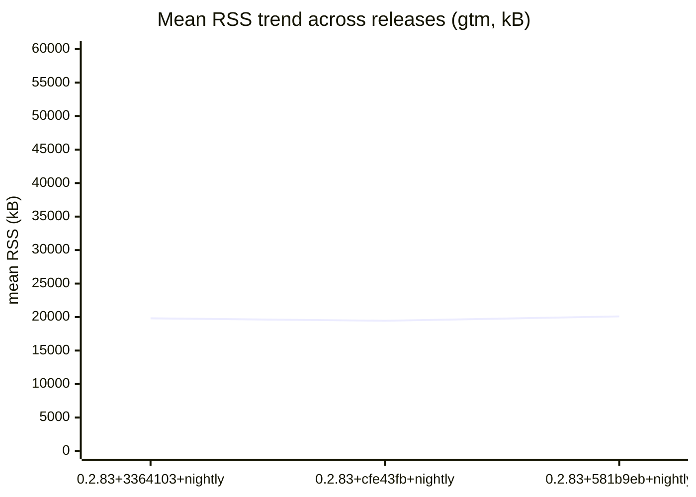

# gtm Benchmarks

Automated measurements of gtm's resource usage during playback, compared
release-over-release and against the reference CLI player **cliamp**
([bjarneo/cliamp](https://github.com/bjarneo/cliamp)).

> **This run**: release `0.2.83+581b9eb+nightly` (commit `581b9ebcfa6a146277196701c122bedca782e180`, 2026-09-09T20:48:19Z).

## Headline — diff vs the last published release (`0.2.83+3364103+nightly`)

| Fixture (player) | Metric | Prev (`0.2.83+3364103+nightly`) | This | Δ |
|------------------|--------|------:|-----:|---:|
| bench.flac (gtm) | peak RSS (kB) | 19860 | 20140 | **+280** |
| bench.flac (gtm) | mean RSS (kB) | 19817 | 20097 | **+280** |
| bench.flac (gtm) | CPU (ms) | 120 | 120 | 0 |
| bench.flac (gtm) | RSS @5s (kB) | 19732 | 20012 | **+280** |
| bench.mp3 (gtm) | peak RSS (kB) | 19536 | 20388 | **+852** |
| bench.mp3 (gtm) | mean RSS (kB) | 19518 | 20370 | **+852** |
| bench.mp3 (gtm) | CPU (ms) | 240 | 210 | **−30** |
| bench.mp3 (gtm) | RSS @5s (kB) | 19428 | 20280 | **+852** |

## Peak RSS by release (gtm vs cliamp, kB)

```mermaid
xychart-beta
  title "Peak RSS by release (gtm vs cliamp, kB)"
  x-axis ["prev", "this"]
  y-axis "peak RSS (kB)" 0 --> 120000
  bar [19860, 20140]
  bar [19536, 20388]
```

## Mean RSS trend across releases (gtm, kB)

## History

| Release | Date | gtm peak RSS (kB) (FLAC) |
|---------|------|-----:|
| 0.2.83+581b9eb+nightly | 2026-09-09 | 20140 |
| 0.2.83+3364103+nightly | 2026-09-08 | 19860 |
| 0.2.83+cfe43fb+nightly | 2026-09-08 | 19492 |
| 0.2.83+0ba44c5+nightly | 2026-09-09 | 19512 |

## Methodology

- A single representative FLAC and one MP3 (both committed under a sealed
  fixture hash — see `bench-results/fixtures/` and `gen-fixtures.sh -c`) are
  played for the same window for gtm and cliamp.
- gtm runs through its headless daemon in `--test-mode` (NullMixer, no audio
  device) so CPU/RSS are measured without an audio sink.
- Metrics: peak / mean / at-5s RSS (kB, from `/proc/<pid>/status` `VmRSS`),
  CPU (ms, from `/proc/<pid>/stat` utime+stime), and t_ready (ms, IPC round
  trip to first playing state — informational only).
- Harness: `scripts/bench/run-bench.sh <player> <file> <seconds>`; collection:
  `scripts/bench/collect.sh <tag>`; this renderer: `scripts/bench/render-bench.sh`.
