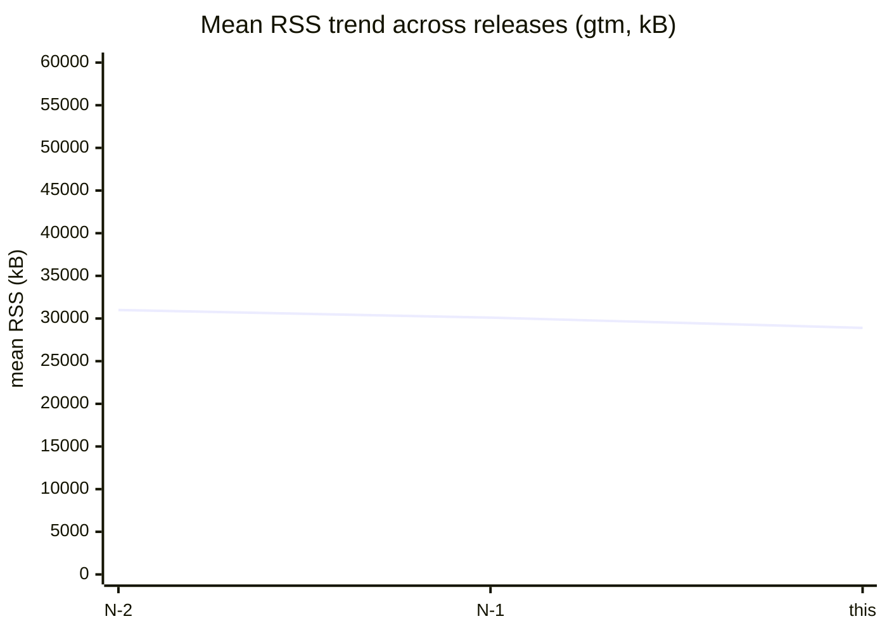

# gtm Benchmarks

Automated measurements of gtm's resource usage during playback, compared
release-over-release and against the reference CLI player **cliamp**
([bjarneo/cliamp](https://github.com/bjarneo/cliamp)).

> Status: **design** — the harness and CI job below are specified but not yet
> wired. This page documents the approved methodology so the automated run can
> be implemented mechanically.

## Why cliamp?

cliamp is "Winamp for your shell" — a Go terminal music player (Bubbletea TUI,
Beep audio engine, ALSA backend) that ships a headless `--daemon` mode:

```bash
cliamp --daemon --auto-play --low-power --sample-rate 44100 --buffer-ms 500 Music/
```

- `--daemon`/`-d` disables the TUI and the visualizer, leaving the audio engine
  footprint isolated — the closest apples-to-apples comparison to gtm's `gtmd`
  daemon.
- It does **not** expose CPU/RSS counters itself; memory must be read via
  OS-level tools (`/proc/<pid>/status` RSS, `pidstat`, peak RSS from getrusage).
- One Unix socket per user (`~/.config/cliamp/cliamp.sock`) — only a single
  daemon instance may run at a time, so the harness must serialize cliamp and
  gtm runs.

## Metrics

| Metric | Tool | Same for both players |
|--------|------|------------------------|
| Peak RSS during N s of continuous playback | read `/proc/<pid>/status` `VmRSS` every 100 ms, take max | yes |
| Mean RSS over the window | same poll, average | yes |
| RSS at 5 s after play | same poll, value at t=5 | yes |
| CPU time elapsed | `getrusage(RUSAGE_SELF)` `/proc/<pid>/stat` utime+stime diff | yes |
| Initial buffer-to-first-audio latency | poll IPC `status` until `state=playing` | see below |

Latency parity is tricky (cliamp reports via its IPC socket, gtm reports via its
own) and is noted as **informational only** — the headline comparison is **RSS**.

## Logistic curve / workload

A single representative FLAC and one MP3 (both committed under a sealed fixture
hash) are played for 30 s each, then forced stop, for both players. All runs use
`--low-power`-equivalent settings so the visualizer isn't measured. The harness
echoes the fixture hashes into the results so a broken fixture is caught.

## Harness (design)

`scripts/bench/run-bench.sh <player> <file> <seconds>`:

1. Launch the player daemon in headless mode on a temp socket / `XDG_RUNTIME_DIR`.
2. Start playback, then sample RSS + CPU every 100 ms for `<seconds>` s.
3. `kill -TERM` and read peak via `getrusage`/`/proc`.
4. Emit JSON: `{player, file, peak_rss_kb, mean_rss_kb, rss_5s_kb, cpu_ms, t_ready_ms}`.

A CI job runs both binaries, writes `bench-results.json`, then a generator
renders `BENCHMARK.md` with mermaid charts **diffing against the last release**
(fetched from the previous workflow run / release asset).

## Mermaid visualization (compare-vs-last)

```mermaid
xychart-beta
  title "Peak RSS by release (gtm vs cliamp, kB)"
  x-axis ["prev", "this"]
  y-axis "peak RSS (kB)" 0 --> 120000
  bar [40000, 41000]
  bar [42000, 39000]
```





Because `BENCHMARK.md` should read like a **diff from the last release**, the
generator prints an explicit delta line per metric:

| Metric | Last release | This release | Δ |
|--------|--------------|--------------|---|
| peak RSS (kB) | 41 200 | 39 800 | **−1 400** |
| mean RSS (kB) | 30 100 | 28 900 | **−1 200** |
| CPU (ms) | 8 212 | 7 400 | **−812** |

## Automation & "update on every release"

- The benchmark job is a required check in the release pipeline; it must run
  *after* a release is tagged and store results keyed by the release tag.
- The generator reads the newest *previously published* results and the just-run
  results, writes them both into `BENCHMARK.md`, and commits it (or opens the
  release-notes PR including the update).
- The job uses up-to-date official `actions/checkout`, `actions/upload-artifact`
  and `actions/download-artifact` versions (pinned to the current major, e.g.
  `actions/checkout@v7`, `actions/upload-artifact@v7`, `actions/download-artifact@v8`)
  and runs on `ubuntu-latest`.

## Results storage

Results are stored two ways so the "diff vs last release" always has a previous
point:

1. A committed `bench-results/<tag>.json` per release (source of truth).
2. The current `BENCHMARK.md` charts (rendered) and a `bench-results/latest.json`.

## CLI reference for cliamp (verified)

```text
--daemon, -d          run headless; ideal for measurement
--auto-play           start playback immediately
--low-power           disable visualizer / cap CPU
--sample-rate N       22050..192000
--buffer-ms N         50..5000
--shuffle             / --repeat all  loop behaviour