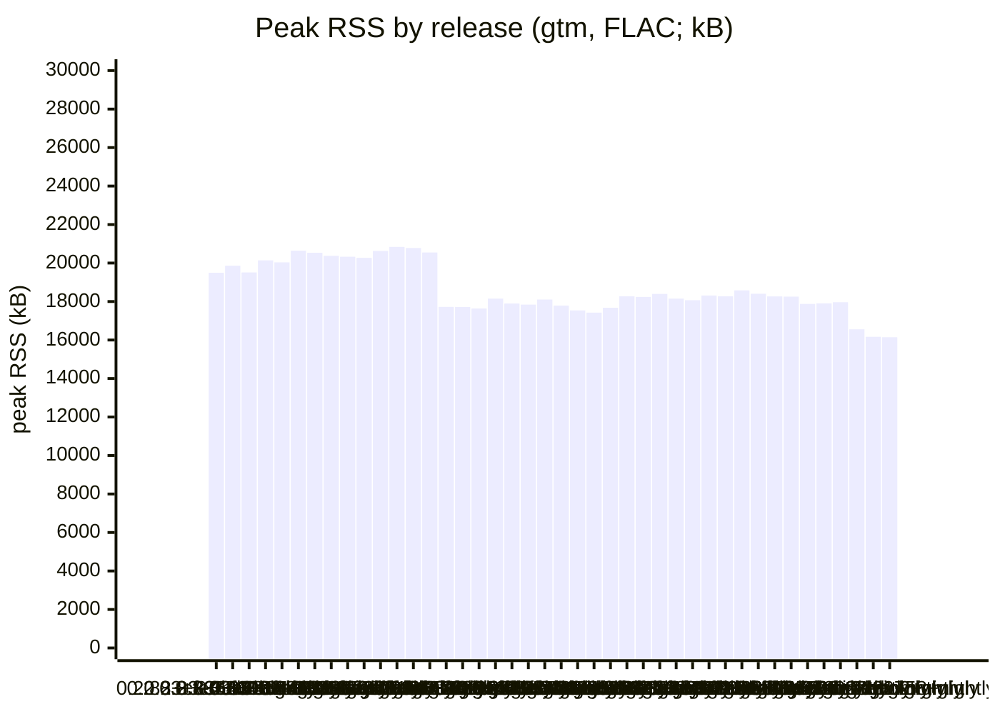
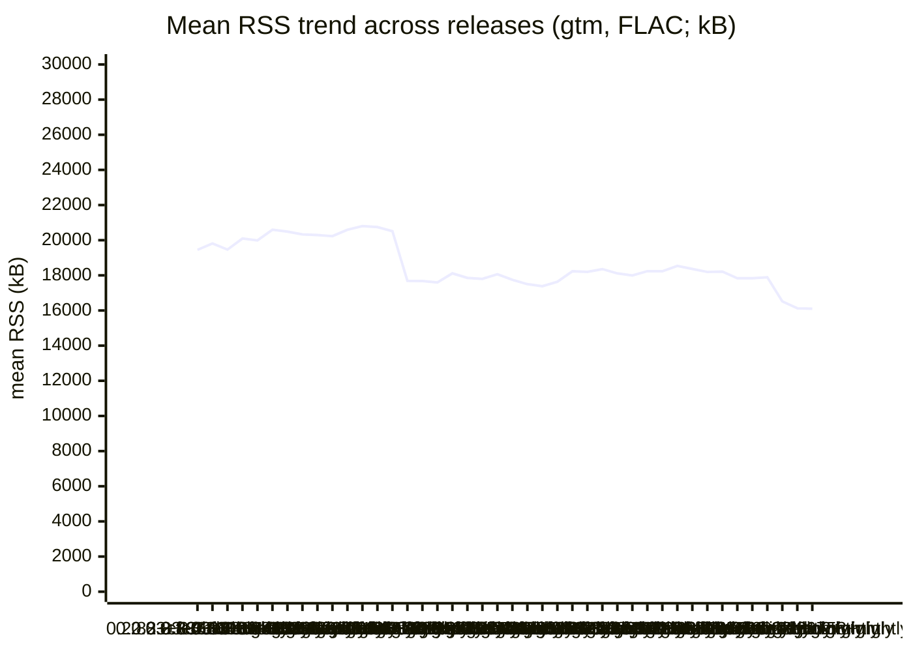
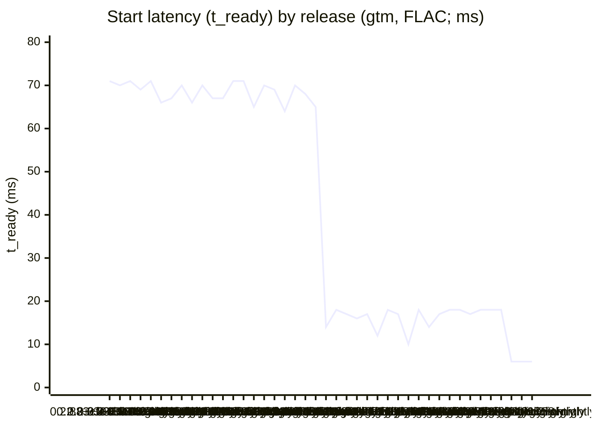

# gtm Benchmarks

Automated measurements of gtm's resource usage during playback, compared
release-over-release and against the reference CLI player **cliamp**
([bjarneo/cliamp](https://github.com/bjarneo/cliamp)).

> **This run**: release `0.2.83+9181758+nightly` (commit `9181758278c538ae13ada825c50055143b7c060f`, 2026-09-26T10:53:23Z).

## Headline — diff vs the last published release (`0.2.83+028bbc2+nightly`)

| Fixture (player) | Metric | Prev (`0.2.83+028bbc2+nightly`) | This | Δ |
|------------------|--------|------:|-----:|---:|
| bench.flac (gtm) | peak RSS (kB) | 16168 | 16144 | **−24** |
| bench.flac (gtm) | mean RSS (kB) | 16125 | 16101 | **−24** |
| bench.flac (gtm) | CPU (ms) | 110 | 80 | **−30** |
| bench.flac (gtm) | RSS @5s (kB) | 16044 | 16020 | **−24** |

## Peak RSS by release (gtm, FLAC; kB)

## Mean RSS trend across releases (gtm, FLAC; kB)

## Start latency (t_ready) by release (gtm, FLAC; ms)

## History

| Release | Date | gtm peak RSS (kB) | gtm mean RSS (kB) | gtm t_ready (ms) |
|---------|------|-----:|-----:|-----:|
| 0.2.83+cfe43fb+nightly | 2026-09-08 | 19492 | 19449 | 71 |
| 0.2.83+3364103+nightly | 2026-09-08 | 19860 | 19817 | 70 |
| 0.2.83+0ba44c5+nightly | 2026-09-09 | 19512 | 19469 | 71 |
| 0.2.83+581b9eb+nightly | 2026-09-09 | 20140 | 20097 | 69 |
| 0.2.83+7b6746d+nightly | 2026-09-10 | 20036 | 19993 | 71 |
| 0.2.83+cf44858+nightly | 2026-09-10 | 20640 | 20597 | 66 |
| 0.2.83+ab3350d+nightly | 2026-09-10 | 20532 | 20489 | 67 |
| 0.2.83+0305f9a+nightly | 2026-09-10 | 20376 | 20333 | 70 |
| 0.2.83+3a0a726+nightly | 2026-09-11 | 20328 | 20293 | 66 |
| 0.2.83+487b302+nightly | 2026-09-11 | 20268 | 20233 | 70 |
| 0.2.83+3e10016+nightly | 2026-09-12 | 20628 | 20593 | 67 |
| 0.2.83+1d3fd86+nightly | 2026-09-13 | 20840 | 20805 | 67 |
| 0.2.83+ff13d58+nightly | 2026-09-13 | 20780 | 20746 | 71 |
| 0.2.83+dca7ff3+nightly | 2026-09-14 | 20548 | 20514 | 71 |
| 0.2.83+d84752d+nightly | 2026-09-14 | 17724 | 17683 | 65 |
| 0.2.83+03962c3+nightly | 2026-09-14 | 17720 | 17679 | 70 |
| 0.2.83+72c64db+nightly | 2026-09-15 | 17636 | 17596 | 69 |
| 0.2.83+9dbcbd3+nightly | 2026-09-15 | 18152 | 18113 | 64 |
| 0.2.83+2e8f8c0+nightly | 2026-09-15 | 17896 | 17855 | 70 |
| 0.2.83+6d5ffbc+nightly | 2026-09-15 | 17840 | 17800 | 68 |
| 0.2.83+72e7f35+nightly | 2026-09-16 | 18104 | 18063 | 65 |
| 0.2.83+354d495+nightly | 2026-09-17 | 17792 | 17751 | 14 |
| 0.2.83+d780bd2+nightly | 2026-09-19 | 17540 | 17499 | 18 |
| 0.2.83+29ca322+nightly | 2026-09-19 | 17424 | 17384 | 17 |
| 0.2.83+0db6b8f+nightly | 2026-09-19 | 17676 | 17635 | 16 |
| 0.2.83+e5d8a6f+nightly | 2026-09-19 | 18272 | 18232 | 17 |
| 0.2.83+8d4ac02+nightly | 2026-09-20 | 18240 | 18200 | 12 |
| 0.2.83+832e3c7+nightly | 2026-09-20 | 18396 | 18356 | 18 |
| 0.2.83+b3cb5eb+nightly | 2026-09-20 | 18152 | 18112 | 17 |
| 0.2.83+6b97229+nightly | 2026-09-21 | 18068 | 17996 | 10 |
| 0.2.83+4b2e7a0+nightly | 2026-09-21 | 18312 | 18238 | 18 |
| 0.2.83+4cf395b+nightly | 2026-09-22 | 18272 | 18231 | 14 |
| 0.2.83+11bd4d4+nightly | 2026-09-22 | 18580 | 18537 | 17 |
| 0.2.83+bb23574+nightly | 2026-09-23 | 18404 | 18364 | 18 |
| 0.2.83+7aedba7+nightly | 2026-09-23 | 18264 | 18192 | 18 |
| 0.2.83+ff19ecf+nightly | 2026-09-23 | 18256 | 18216 | 17 |
| 0.2.83+f3a58ad+nightly | 2026-09-24 | 17876 | 17835 | 18 |
| 0.2.83+07516cb+nightly | 2026-09-24 | 17904 | 17832 | 18 |
| 0.2.83+442c67a+nightly | 2026-09-24 | 17964 | 17892 | 18 |
| 0.2.83+0ee1d29+nightly | 2026-09-24 | 16556 | 16516 | 6 |
| 0.2.83+028bbc2+nightly | 2026-09-26 | 16168 | 16125 | 6 |
| 0.2.83+9181758+nightly | 2026-09-26 | 16144 | 16101 | 6 |

## Machine-readable history

Past results are stored only in the markers below; `render.sh`
reconstructs trend history from them. Do not edit by hand.

<!--bench:{"tag":"0.2.83+cfe43fb+nightly","date":"2026-09-08T17:55:34Z","commit":"cfe43fbf581ce65bd900879a5883f49d610243e0","seconds":"152","runs":{"gtm/bench.flac":{"file_sha256":"c5e5c960cf59e5fdf3f3b68ea94a24d5f3d4b1122697e4e19d5ec5c1c3e175de","peak_rss_kb":19492,"mean_rss_kb":19449,"rss_5s_kb":19364,"cpu_ms":120,"t_ready_ms":71},"gtm/bench.mp3":{"file_sha256":"6bd083a60ca94245ffd8d1be73e4b83eaab0fb6eeb6648e214ca528563a0bbfd","peak_rss_kb":19924,"mean_rss_kb":19905,"rss_5s_kb":19816,"cpu_ms":210,"t_ready_ms":71}}}-->
<!--bench:{"tag":"0.2.83+3364103+nightly","date":"2026-09-08T20:00:21Z","commit":"336410342811a809587a27820b9d4fcc355237a5","seconds":"154","runs":{"gtm/bench.flac":{"file_sha256":"c5e5c960cf59e5fdf3f3b68ea94a24d5f3d4b1122697e4e19d5ec5c1c3e175de","peak_rss_kb":19860,"mean_rss_kb":19817,"rss_5s_kb":19732,"cpu_ms":120,"t_ready_ms":70},"gtm/bench.mp3":{"file_sha256":"6bd083a60ca94245ffd8d1be73e4b83eaab0fb6eeb6648e214ca528563a0bbfd","peak_rss_kb":19536,"mean_rss_kb":19518,"rss_5s_kb":19428,"cpu_ms":240,"t_ready_ms":70}}}-->
<!--bench:{"tag":"0.2.83+0ba44c5+nightly","date":"2026-09-09T05:31:12Z","commit":"0ba44c500b35a5321172f2929fbf43fd4de64434","seconds":"153","runs":{"gtm/bench.flac":{"file_sha256":"c5e5c960cf59e5fdf3f3b68ea94a24d5f3d4b1122697e4e19d5ec5c1c3e175de","peak_rss_kb":19512,"mean_rss_kb":19469,"rss_5s_kb":19384,"cpu_ms":110,"t_ready_ms":71},"gtm/bench.mp3":{"file_sha256":"6bd083a60ca94245ffd8d1be73e4b83eaab0fb6eeb6648e214ca528563a0bbfd","peak_rss_kb":19540,"mean_rss_kb":19522,"rss_5s_kb":19432,"cpu_ms":210,"t_ready_ms":71}}}-->
<!--bench:{"tag":"0.2.83+581b9eb+nightly","date":"2026-09-09T20:48:19Z","commit":"581b9ebcfa6a146277196701c122bedca782e180","seconds":"154","runs":{"gtm/bench.flac":{"file_sha256":"c5e5c960cf59e5fdf3f3b68ea94a24d5f3d4b1122697e4e19d5ec5c1c3e175de","peak_rss_kb":20140,"mean_rss_kb":20097,"rss_5s_kb":20012,"cpu_ms":120,"t_ready_ms":69},"gtm/bench.mp3":{"file_sha256":"6bd083a60ca94245ffd8d1be73e4b83eaab0fb6eeb6648e214ca528563a0bbfd","peak_rss_kb":20388,"mean_rss_kb":20370,"rss_5s_kb":20280,"cpu_ms":210,"t_ready_ms":70}}}-->
<!--bench:{"tag":"0.2.83+7b6746d+nightly","date":"2026-09-10T06:06:28Z","commit":"7b6746d893eb83d1de2e18e9289c416420bb7b94","seconds":"154","runs":{"gtm/bench.flac":{"file_sha256":"c5e5c960cf59e5fdf3f3b68ea94a24d5f3d4b1122697e4e19d5ec5c1c3e175de","peak_rss_kb":20036,"mean_rss_kb":19993,"rss_5s_kb":19908,"cpu_ms":170,"t_ready_ms":71},"gtm/bench.mp3":{"file_sha256":"6bd083a60ca94245ffd8d1be73e4b83eaab0fb6eeb6648e214ca528563a0bbfd","peak_rss_kb":20856,"mean_rss_kb":20838,"rss_5s_kb":20748,"cpu_ms":290,"t_ready_ms":70}}}-->
<!--bench:{"tag":"0.2.83+cf44858+nightly","date":"2026-09-10T09:49:45Z","commit":"cf44858c93d96f5b91a11c96226e05cd98ec97af","seconds":"152","runs":{"gtm/bench.flac":{"file_sha256":"c5e5c960cf59e5fdf3f3b68ea94a24d5f3d4b1122697e4e19d5ec5c1c3e175de","peak_rss_kb":20640,"mean_rss_kb":20597,"rss_5s_kb":20512,"cpu_ms":100,"t_ready_ms":66,"p50_latency_kb":20640,"p95_latency_kb":20640},"gtm/bench.mp3":{"file_sha256":"6bd083a60ca94245ffd8d1be73e4b83eaab0fb6eeb6648e214ca528563a0bbfd","peak_rss_kb":20776,"mean_rss_kb":20758,"rss_5s_kb":20668,"cpu_ms":180,"t_ready_ms":67,"p50_latency_kb":20776,"p95_latency_kb":20776}}}-->
<!--bench:{"tag":"0.2.83+ab3350d+nightly","date":"2026-09-10T14:10:54Z","commit":"ab3350de96b1e92d1893959d78622819538d8621","seconds":"152","runs":{"gtm/bench.flac":{"file_sha256":"c5e5c960cf59e5fdf3f3b68ea94a24d5f3d4b1122697e4e19d5ec5c1c3e175de","peak_rss_kb":20532,"mean_rss_kb":20489,"rss_5s_kb":20404,"cpu_ms":90,"t_ready_ms":67,"p50_latency_kb":20532,"p95_latency_kb":20532},"gtm/bench.mp3":{"file_sha256":"6bd083a60ca94245ffd8d1be73e4b83eaab0fb6eeb6648e214ca528563a0bbfd","peak_rss_kb":20912,"mean_rss_kb":20883,"rss_5s_kb":20740,"cpu_ms":150,"t_ready_ms":68,"p50_latency_kb":20912,"p95_latency_kb":20912}}}-->
<!--bench:{"tag":"0.2.83+0305f9a+nightly","date":"2026-09-10T20:16:24Z","commit":"0305f9a44dd09c897126ad9bf85be1193dedaaf1","seconds":"152","runs":{"gtm/bench.flac":{"file_sha256":"c5e5c960cf59e5fdf3f3b68ea94a24d5f3d4b1122697e4e19d5ec5c1c3e175de","peak_rss_kb":20376,"mean_rss_kb":20333,"rss_5s_kb":20248,"cpu_ms":120,"t_ready_ms":70,"p50_latency_kb":20376,"p95_latency_kb":20376},"gtm/bench.mp3":{"file_sha256":"6bd083a60ca94245ffd8d1be73e4b83eaab0fb6eeb6648e214ca528563a0bbfd","peak_rss_kb":20712,"mean_rss_kb":20693,"rss_5s_kb":20604,"cpu_ms":220,"t_ready_ms":70,"p50_latency_kb":20712,"p95_latency_kb":20712}}}-->
<!--bench:{"tag":"0.2.83+3a0a726+nightly","date":"2026-09-11T19:36:34Z","commit":"3a0a726f42d9a04bcdd63739cff54b4bf958ab32","seconds":"152","runs":{"gtm/bench.flac":{"file_sha256":"c5e5c960cf59e5fdf3f3b68ea94a24d5f3d4b1122697e4e19d5ec5c1c3e175de","peak_rss_kb":20328,"mean_rss_kb":20293,"rss_5s_kb":20224,"cpu_ms":100,"t_ready_ms":66,"p50_latency_kb":20328,"p95_latency_kb":20328},"gtm/bench.mp3":{"file_sha256":"6bd083a60ca94245ffd8d1be73e4b83eaab0fb6eeb6648e214ca528563a0bbfd","peak_rss_kb":20924,"mean_rss_kb":20906,"rss_5s_kb":20820,"cpu_ms":180,"t_ready_ms":67,"p50_latency_kb":20924,"p95_latency_kb":20924}}}-->
<!--bench:{"tag":"0.2.83+487b302+nightly","date":"2026-09-11T20:00:04Z","commit":"487b302341a10de5ed97b62fe4c34e057e1461f1","seconds":"154","runs":{"gtm/bench.flac":{"file_sha256":"c5e5c960cf59e5fdf3f3b68ea94a24d5f3d4b1122697e4e19d5ec5c1c3e175de","peak_rss_kb":20268,"mean_rss_kb":20233,"rss_5s_kb":20164,"cpu_ms":100,"t_ready_ms":70,"p50_latency_kb":20268,"p95_latency_kb":20268},"gtm/bench.mp3":{"file_sha256":"6bd083a60ca94245ffd8d1be73e4b83eaab0fb6eeb6648e214ca528563a0bbfd","peak_rss_kb":20524,"mean_rss_kb":20506,"rss_5s_kb":20420,"cpu_ms":170,"t_ready_ms":69,"p50_latency_kb":20524,"p95_latency_kb":20524}}}-->
<!--bench:{"tag":"0.2.83+3e10016+nightly","date":"2026-09-12T13:00:32Z","commit":"3e100168e456d29fee2c3cabd7616ff28e646a80","seconds":"152","runs":{"gtm/bench.flac":{"file_sha256":"c5e5c960cf59e5fdf3f3b68ea94a24d5f3d4b1122697e4e19d5ec5c1c3e175de","peak_rss_kb":20628,"mean_rss_kb":20593,"rss_5s_kb":20524,"cpu_ms":90,"t_ready_ms":67,"p50_latency_kb":20628,"p95_latency_kb":20628},"gtm/bench.mp3":{"file_sha256":"6bd083a60ca94245ffd8d1be73e4b83eaab0fb6eeb6648e214ca528563a0bbfd","peak_rss_kb":20764,"mean_rss_kb":20746,"rss_5s_kb":20660,"cpu_ms":150,"t_ready_ms":67,"p50_latency_kb":20764,"p95_latency_kb":20764}}}-->
<!--bench:{"tag":"0.2.83+1d3fd86+nightly","date":"2026-09-13T09:36:04Z","commit":"1d3fd8603feea2f4d393859502fc9cbb62f35c36","seconds":"152","runs":{"gtm/bench.flac":{"file_sha256":"c5e5c960cf59e5fdf3f3b68ea94a24d5f3d4b1122697e4e19d5ec5c1c3e175de","peak_rss_kb":20840,"mean_rss_kb":20805,"rss_5s_kb":20736,"cpu_ms":120,"t_ready_ms":67,"p50_latency_kb":20840,"p95_latency_kb":20840},"gtm/bench.mp3":{"file_sha256":"6bd083a60ca94245ffd8d1be73e4b83eaab0fb6eeb6648e214ca528563a0bbfd","peak_rss_kb":21100,"mean_rss_kb":21082,"rss_5s_kb":20996,"cpu_ms":210,"t_ready_ms":67,"p50_latency_kb":21100,"p95_latency_kb":21100}}}-->
<!--bench:{"tag":"0.2.83+ff13d58+nightly","date":"2026-09-13T10:28:17Z","commit":"ff13d582992fd6b1e3960f08be8b034e5e49d2b2","seconds":"156","runs":{"gtm/bench.flac":{"file_sha256":"c5e5c960cf59e5fdf3f3b68ea94a24d5f3d4b1122697e4e19d5ec5c1c3e175de","peak_rss_kb":20780,"mean_rss_kb":20746,"rss_5s_kb":20676,"cpu_ms":130,"t_ready_ms":71,"p50_latency_kb":20780,"p95_latency_kb":20780},"gtm/bench.mp3":{"file_sha256":"6bd083a60ca94245ffd8d1be73e4b83eaab0fb6eeb6648e214ca528563a0bbfd","peak_rss_kb":20880,"mean_rss_kb":20863,"rss_5s_kb":20776,"cpu_ms":230,"t_ready_ms":71,"p50_latency_kb":20880,"p95_latency_kb":20880}}}-->
<!--bench:{"tag":"0.2.83+dca7ff3+nightly","date":"2026-09-14T11:26:14Z","commit":"dca7ff370954e3b9105392c40d103db69a37600b","seconds":"156","runs":{"gtm/bench.flac":{"file_sha256":"c5e5c960cf59e5fdf3f3b68ea94a24d5f3d4b1122697e4e19d5ec5c1c3e175de","peak_rss_kb":20548,"mean_rss_kb":20514,"rss_5s_kb":20444,"cpu_ms":130,"t_ready_ms":71,"rss_p50_kb":20548,"rss_p95_kb":20548},"gtm/bench.mp3":{"file_sha256":"6bd083a60ca94245ffd8d1be73e4b83eaab0fb6eeb6648e214ca528563a0bbfd","peak_rss_kb":20804,"mean_rss_kb":20787,"rss_5s_kb":20700,"cpu_ms":250,"t_ready_ms":72,"rss_p50_kb":20804,"rss_p95_kb":20804}}}-->
<!--bench:{"tag":"0.2.83+d84752d+nightly","date":"2026-09-14T17:41:14Z","commit":"d84752d432ac19748dfad2fa4b46d6b5a9faa9e2","seconds":"152","runs":{"gtm/bench.flac":{"file_sha256":"c5e5c960cf59e5fdf3f3b68ea94a24d5f3d4b1122697e4e19d5ec5c1c3e175de","peak_rss_kb":17724,"mean_rss_kb":17683,"rss_5s_kb":17604,"cpu_ms":110,"t_ready_ms":65,"rss_p50_kb":17724,"rss_p95_kb":17724},"gtm/bench.mp3":{"file_sha256":"6bd083a60ca94245ffd8d1be73e4b83eaab0fb6eeb6648e214ca528563a0bbfd","peak_rss_kb":17876,"mean_rss_kb":17858,"rss_5s_kb":17768,"cpu_ms":170,"t_ready_ms":66,"rss_p50_kb":17876,"rss_p95_kb":17876}}}-->
<!--bench:{"tag":"0.2.83+03962c3+nightly","date":"2026-09-14T18:18:22Z","commit":"03962c3fa90da6de3f76d8dbeef000cbdacc23df","seconds":"154","runs":{"gtm/bench.flac":{"file_sha256":"c5e5c960cf59e5fdf3f3b68ea94a24d5f3d4b1122697e4e19d5ec5c1c3e175de","peak_rss_kb":17720,"mean_rss_kb":17679,"rss_5s_kb":17600,"cpu_ms":120,"t_ready_ms":70,"rss_p50_kb":17720,"rss_p95_kb":17720},"gtm/bench.mp3":{"file_sha256":"6bd083a60ca94245ffd8d1be73e4b83eaab0fb6eeb6648e214ca528563a0bbfd","peak_rss_kb":18248,"mean_rss_kb":18230,"rss_5s_kb":18140,"cpu_ms":210,"t_ready_ms":69,"rss_p50_kb":18248,"rss_p95_kb":18248}}}-->
<!--bench:{"tag":"0.2.83+72c64db+nightly","date":"2026-09-15T11:38:05Z","commit":"72c64dbd544539508241ebf7e3f6a36af1e10e90","seconds":"152","runs":{"gtm/bench.flac":{"file_sha256":"c5e5c960cf59e5fdf3f3b68ea94a24d5f3d4b1122697e4e19d5ec5c1c3e175de","peak_rss_kb":17636,"mean_rss_kb":17596,"rss_5s_kb":17516,"cpu_ms":130,"t_ready_ms":69,"rss_p50_kb":17636,"rss_p95_kb":17636},"gtm/bench.mp3":{"file_sha256":"6bd083a60ca94245ffd8d1be73e4b83eaab0fb6eeb6648e214ca528563a0bbfd","peak_rss_kb":18144,"mean_rss_kb":18126,"rss_5s_kb":18036,"cpu_ms":230,"t_ready_ms":71,"rss_p50_kb":18144,"rss_p95_kb":18144}}}-->
<!--bench:{"tag":"0.2.83+9dbcbd3+nightly","date":"2026-09-15T17:16:24Z","commit":"9dbcbd3fe4584d85963a778c8dd3801b31577195","seconds":"155","runs":{"gtm/bench.flac":{"file_sha256":"c5e5c960cf59e5fdf3f3b68ea94a24d5f3d4b1122697e4e19d5ec5c1c3e175de","peak_rss_kb":18152,"mean_rss_kb":18113,"rss_5s_kb":18032,"cpu_ms":80,"t_ready_ms":64,"rss_p50_kb":18152,"rss_p95_kb":18152},"gtm/bench.mp3":{"file_sha256":"6bd083a60ca94245ffd8d1be73e4b83eaab0fb6eeb6648e214ca528563a0bbfd","peak_rss_kb":18104,"mean_rss_kb":18086,"rss_5s_kb":17996,"cpu_ms":150,"t_ready_ms":64,"rss_p50_kb":18104,"rss_p95_kb":18104}}}-->
<!--bench:{"tag":"0.2.83+2e8f8c0+nightly","date":"2026-09-15T18:44:16Z","commit":"2e8f8c0cb00ef549fc2a70c7438de504cf25fc8a","seconds":"152","runs":{"gtm/bench.flac":{"file_sha256":"c5e5c960cf59e5fdf3f3b68ea94a24d5f3d4b1122697e4e19d5ec5c1c3e175de","peak_rss_kb":17896,"mean_rss_kb":17855,"rss_5s_kb":17776,"cpu_ms":120,"t_ready_ms":70,"rss_p50_kb":17896,"rss_p95_kb":17896},"gtm/bench.mp3":{"file_sha256":"6bd083a60ca94245ffd8d1be73e4b83eaab0fb6eeb6648e214ca528563a0bbfd","peak_rss_kb":18084,"mean_rss_kb":18065,"rss_5s_kb":17976,"cpu_ms":230,"t_ready_ms":69,"rss_p50_kb":18084,"rss_p95_kb":18084}}}-->
<!--bench:{"tag":"0.2.83+6d5ffbc+nightly","date":"2026-09-15T20:51:28Z","commit":"6d5ffbc2671d6b88c9efa337e5f310f95ab5f1f8","seconds":"154","runs":{"gtm/bench.flac":{"file_sha256":"c5e5c960cf59e5fdf3f3b68ea94a24d5f3d4b1122697e4e19d5ec5c1c3e175de","peak_rss_kb":17840,"mean_rss_kb":17800,"rss_5s_kb":17720,"cpu_ms":130,"t_ready_ms":68,"rss_p50_kb":17840,"rss_p95_kb":17840},"gtm/bench.mp3":{"file_sha256":"6bd083a60ca94245ffd8d1be73e4b83eaab0fb6eeb6648e214ca528563a0bbfd","peak_rss_kb":18308,"mean_rss_kb":18290,"rss_5s_kb":18200,"cpu_ms":250,"t_ready_ms":70,"rss_p50_kb":18308,"rss_p95_kb":18308}}}-->
<!--bench:{"tag":"0.2.83+72e7f35+nightly","date":"2026-09-16T12:18:02Z","commit":"72e7f356d09737be6a996b8f615ed8a4898509a5","seconds":"151","runs":{"gtm/bench.flac":{"file_sha256":"c5e5c960cf59e5fdf3f3b68ea94a24d5f3d4b1122697e4e19d5ec5c1c3e175de","peak_rss_kb":18104,"mean_rss_kb":18063,"rss_5s_kb":17984,"cpu_ms":70,"t_ready_ms":65,"rss_p50_kb":18104,"rss_p95_kb":18104},"gtm/bench.mp3":{"file_sha256":"6bd083a60ca94245ffd8d1be73e4b83eaab0fb6eeb6648e214ca528563a0bbfd","peak_rss_kb":18092,"mean_rss_kb":18073,"rss_5s_kb":17984,"cpu_ms":130,"t_ready_ms":66,"rss_p50_kb":18092,"rss_p95_kb":18092}}}-->
<!--bench:{"tag":"0.2.83+354d495+nightly","date":"2026-09-17T14:09:54Z","commit":"354d495e1d2fe9209e5a4d131f4b66129bbf73ed","seconds":"152","runs":{"gtm/bench.flac":{"file_sha256":"c5e5c960cf59e5fdf3f3b68ea94a24d5f3d4b1122697e4e19d5ec5c1c3e175de","peak_rss_kb":17792,"mean_rss_kb":17751,"rss_5s_kb":17672,"cpu_ms":100,"t_ready_ms":14,"rss_p50_kb":17792,"rss_p95_kb":17792},"gtm/bench.mp3":{"file_sha256":"6bd083a60ca94245ffd8d1be73e4b83eaab0fb6eeb6648e214ca528563a0bbfd","peak_rss_kb":18128,"mean_rss_kb":18109,"rss_5s_kb":18020,"cpu_ms":170,"t_ready_ms":14,"rss_p50_kb":18128,"rss_p95_kb":18128}}}-->
<!--bench:{"tag":"0.2.83+d780bd2+nightly","date":"2026-09-19T08:21:30Z","commit":"d780bd216a9651b5059718e68495b105df705745","seconds":"152","runs":{"gtm/bench.flac":{"file_sha256":"c5e5c960cf59e5fdf3f3b68ea94a24d5f3d4b1122697e4e19d5ec5c1c3e175de","peak_rss_kb":17540,"mean_rss_kb":17499,"rss_5s_kb":17420,"cpu_ms":130,"t_ready_ms":18,"rss_p50_kb":17540,"rss_p95_kb":17540},"gtm/bench.mp3":{"file_sha256":"6bd083a60ca94245ffd8d1be73e4b83eaab0fb6eeb6648e214ca528563a0bbfd","peak_rss_kb":17848,"mean_rss_kb":17829,"rss_5s_kb":17740,"cpu_ms":240,"t_ready_ms":18,"rss_p50_kb":17848,"rss_p95_kb":17848}}}-->
<!--bench:{"tag":"0.2.83+29ca322+nightly","date":"2026-09-19T20:12:22Z","commit":"29ca322be52809a5cdbbb9419b5281ae62b7ccd5","seconds":"152","runs":{"gtm/bench.flac":{"file_sha256":"c5e5c960cf59e5fdf3f3b68ea94a24d5f3d4b1122697e4e19d5ec5c1c3e175de","peak_rss_kb":17424,"mean_rss_kb":17384,"rss_5s_kb":17304,"cpu_ms":120,"t_ready_ms":17,"rss_p50_kb":17424,"rss_p95_kb":17424},"gtm/bench.mp3":{"file_sha256":"6bd083a60ca94245ffd8d1be73e4b83eaab0fb6eeb6648e214ca528563a0bbfd","peak_rss_kb":17884,"mean_rss_kb":17865,"rss_5s_kb":17776,"cpu_ms":210,"t_ready_ms":17,"rss_p50_kb":17884,"rss_p95_kb":17884}}}-->
<!--bench:{"tag":"0.2.83+0db6b8f+nightly","date":"2026-09-19T21:07:46Z","commit":"0db6b8fc37cd75b93fe6d0d80eaa7a797ca6b35c","seconds":"152","runs":{"gtm/bench.flac":{"file_sha256":"c5e5c960cf59e5fdf3f3b68ea94a24d5f3d4b1122697e4e19d5ec5c1c3e175de","peak_rss_kb":17676,"mean_rss_kb":17635,"rss_5s_kb":17556,"cpu_ms":130,"t_ready_ms":16,"rss_p50_kb":17676,"rss_p95_kb":17676},"gtm/bench.mp3":{"file_sha256":"6bd083a60ca94245ffd8d1be73e4b83eaab0fb6eeb6648e214ca528563a0bbfd","peak_rss_kb":18100,"mean_rss_kb":18081,"rss_5s_kb":17992,"cpu_ms":240,"t_ready_ms":17,"rss_p50_kb":18100,"rss_p95_kb":18100}}}-->
<!--bench:{"tag":"0.2.83+e5d8a6f+nightly","date":"2026-09-19T23:02:14Z","commit":"e5d8a6fa335a05c25b6cb8d1777d2684c2ffb88e","seconds":"152","runs":{"gtm/bench.flac":{"file_sha256":"c5e5c960cf59e5fdf3f3b68ea94a24d5f3d4b1122697e4e19d5ec5c1c3e175de","peak_rss_kb":18272,"mean_rss_kb":18232,"rss_5s_kb":18152,"cpu_ms":120,"t_ready_ms":17,"rss_p50_kb":18272,"rss_p95_kb":18272},"gtm/bench.mp3":{"file_sha256":"6bd083a60ca94245ffd8d1be73e4b83eaab0fb6eeb6648e214ca528563a0bbfd","peak_rss_kb":18088,"mean_rss_kb":18070,"rss_5s_kb":17980,"cpu_ms":210,"t_ready_ms":18,"rss_p50_kb":18088,"rss_p95_kb":18088}}}-->
<!--bench:{"tag":"0.2.83+8d4ac02+nightly","date":"2026-09-20T01:13:52Z","commit":"8d4ac02867e913484b3feb4c11fc5d4800ed7265","seconds":"151","runs":{"gtm/bench.flac":{"file_sha256":"c5e5c960cf59e5fdf3f3b68ea94a24d5f3d4b1122697e4e19d5ec5c1c3e175de","peak_rss_kb":18240,"mean_rss_kb":18200,"rss_5s_kb":18120,"cpu_ms":70,"t_ready_ms":12,"rss_p50_kb":18240,"rss_p95_kb":18240},"gtm/bench.mp3":{"file_sha256":"6bd083a60ca94245ffd8d1be73e4b83eaab0fb6eeb6648e214ca528563a0bbfd","peak_rss_kb":18284,"mean_rss_kb":18265,"rss_5s_kb":18176,"cpu_ms":120,"t_ready_ms":13,"rss_p50_kb":18284,"rss_p95_kb":18284}}}-->
<!--bench:{"tag":"0.2.83+832e3c7+nightly","date":"2026-09-20T15:33:15Z","commit":"832e3c72cca6d5f9efa374bbe1f943cf3f5e28c4","seconds":"156","runs":{"gtm/bench.flac":{"file_sha256":"c5e5c960cf59e5fdf3f3b68ea94a24d5f3d4b1122697e4e19d5ec5c1c3e175de","peak_rss_kb":18396,"mean_rss_kb":18356,"rss_5s_kb":18276,"cpu_ms":140,"t_ready_ms":18,"rss_p50_kb":18396,"rss_p95_kb":18396},"gtm/bench.mp3":{"file_sha256":"6bd083a60ca94245ffd8d1be73e4b83eaab0fb6eeb6648e214ca528563a0bbfd","peak_rss_kb":18092,"mean_rss_kb":18074,"rss_5s_kb":17984,"cpu_ms":250,"t_ready_ms":17,"rss_p50_kb":18092,"rss_p95_kb":18092}}}-->
<!--bench:{"tag":"0.2.83+b3cb5eb+nightly","date":"2026-09-20T21:32:49Z","commit":"b3cb5eb41e73c0d36313a133f26a2f69f9adff81","seconds":"154","runs":{"gtm/bench.flac":{"file_sha256":"c5e5c960cf59e5fdf3f3b68ea94a24d5f3d4b1122697e4e19d5ec5c1c3e175de","peak_rss_kb":18152,"mean_rss_kb":18112,"rss_5s_kb":18032,"cpu_ms":120,"t_ready_ms":17,"rss_p50_kb":18152,"rss_p95_kb":18152},"gtm/bench.mp3":{"file_sha256":"6bd083a60ca94245ffd8d1be73e4b83eaab0fb6eeb6648e214ca528563a0bbfd","peak_rss_kb":17960,"mean_rss_kb":17942,"rss_5s_kb":17852,"cpu_ms":220,"t_ready_ms":17,"rss_p50_kb":17960,"rss_p95_kb":17960}}}-->
<!--bench:{"tag":"0.2.83+6b97229+nightly","date":"2026-09-21T16:38:05Z","commit":"6b972292d3054a63d7a8bce6931a256e0f664ad1","seconds":"155","runs":{"gtm/bench.flac":{"file_sha256":"c5e5c960cf59e5fdf3f3b68ea94a24d5f3d4b1122697e4e19d5ec5c1c3e175de","peak_rss_kb":18068,"mean_rss_kb":17996,"rss_5s_kb":17880,"cpu_ms":70,"t_ready_ms":10,"rss_p50_kb":18068,"rss_p95_kb":18068},"gtm/bench.mp3":{"file_sha256":"6bd083a60ca94245ffd8d1be73e4b83eaab0fb6eeb6648e214ca528563a0bbfd","peak_rss_kb":18256,"mean_rss_kb":18238,"rss_5s_kb":18148,"cpu_ms":110,"t_ready_ms":10,"rss_p50_kb":18256,"rss_p95_kb":18256}}}-->
<!--bench:{"tag":"0.2.83+4b2e7a0+nightly","date":"2026-09-21T17:23:46Z","commit":"4b2e7a071b8ff5d2a9cd97f407ba84ea758dc2a2","seconds":"152","runs":{"gtm/bench.flac":{"file_sha256":"c5e5c960cf59e5fdf3f3b68ea94a24d5f3d4b1122697e4e19d5ec5c1c3e175de","peak_rss_kb":18312,"mean_rss_kb":18238,"rss_5s_kb":18124,"cpu_ms":160,"t_ready_ms":18,"rss_p50_kb":18312,"rss_p95_kb":18312},"gtm/bench.mp3":{"file_sha256":"6bd083a60ca94245ffd8d1be73e4b83eaab0fb6eeb6648e214ca528563a0bbfd","peak_rss_kb":18344,"mean_rss_kb":18308,"rss_5s_kb":18168,"cpu_ms":290,"t_ready_ms":19,"rss_p50_kb":18344,"rss_p95_kb":18344}}}-->
<!--bench:{"tag":"0.2.83+4cf395b+nightly","date":"2026-09-22T12:52:31Z","commit":"4cf395bbcf2a7d52ba25626f6c9c0878f2ffbee2","seconds":"152","runs":{"gtm/bench.flac":{"file_sha256":"c5e5c960cf59e5fdf3f3b68ea94a24d5f3d4b1122697e4e19d5ec5c1c3e175de","peak_rss_kb":18272,"mean_rss_kb":18231,"rss_5s_kb":18152,"cpu_ms":110,"t_ready_ms":14,"rss_p50_kb":18272,"rss_p95_kb":18272},"gtm/bench.mp3":{"file_sha256":"6bd083a60ca94245ffd8d1be73e4b83eaab0fb6eeb6648e214ca528563a0bbfd","peak_rss_kb":18208,"mean_rss_kb":18189,"rss_5s_kb":18100,"cpu_ms":190,"t_ready_ms":14,"rss_p50_kb":18208,"rss_p95_kb":18208}}}-->
<!--bench:{"tag":"0.2.83+11bd4d4+nightly","date":"2026-09-22T14:20:39Z","commit":"11bd4d40a1de9026c276dfcf3a4dd1fb264ddc10","seconds":"154","runs":{"gtm/bench.flac":{"file_sha256":"c5e5c960cf59e5fdf3f3b68ea94a24d5f3d4b1122697e4e19d5ec5c1c3e175de","peak_rss_kb":18580,"mean_rss_kb":18537,"rss_5s_kb":18456,"cpu_ms":130,"t_ready_ms":17,"rss_p50_kb":18580,"rss_p95_kb":18580},"gtm/bench.mp3":{"file_sha256":"6bd083a60ca94245ffd8d1be73e4b83eaab0fb6eeb6648e214ca528563a0bbfd","peak_rss_kb":18412,"mean_rss_kb":18394,"rss_5s_kb":18304,"cpu_ms":260,"t_ready_ms":21,"rss_p50_kb":18412,"rss_p95_kb":18412}}}-->
<!--bench:{"tag":"0.2.83+bb23574+nightly","date":"2026-09-23T18:06:07Z","commit":"bb23574c89f531c91582f3493165125a60cbd3c0","seconds":"152","runs":{"gtm/bench.flac":{"file_sha256":"c5e5c960cf59e5fdf3f3b68ea94a24d5f3d4b1122697e4e19d5ec5c1c3e175de","peak_rss_kb":18404,"mean_rss_kb":18364,"rss_5s_kb":18284,"cpu_ms":130,"t_ready_ms":18,"rss_p50_kb":18404,"rss_p95_kb":18404},"gtm/bench.mp3":{"file_sha256":"6bd083a60ca94245ffd8d1be73e4b83eaab0fb6eeb6648e214ca528563a0bbfd","peak_rss_kb":18332,"mean_rss_kb":18297,"rss_5s_kb":18160,"cpu_ms":250,"t_ready_ms":18,"rss_p50_kb":18332,"rss_p95_kb":18332}}}-->
<!--bench:{"tag":"0.2.83+7aedba7+nightly","date":"2026-09-23T18:36:50Z","commit":"7aedba77b9b85299d98d96416655b500c5df1d5e","seconds":"156","runs":{"gtm/bench.flac":{"file_sha256":"c5e5c960cf59e5fdf3f3b68ea94a24d5f3d4b1122697e4e19d5ec5c1c3e175de","peak_rss_kb":18264,"mean_rss_kb":18192,"rss_5s_kb":18076,"cpu_ms":140,"t_ready_ms":18,"rss_p50_kb":18264,"rss_p95_kb":18264},"gtm/bench.mp3":{"file_sha256":"6bd083a60ca94245ffd8d1be73e4b83eaab0fb6eeb6648e214ca528563a0bbfd","peak_rss_kb":18468,"mean_rss_kb":18450,"rss_5s_kb":18360,"cpu_ms":250,"t_ready_ms":18,"rss_p50_kb":18468,"rss_p95_kb":18468}}}-->
<!--bench:{"tag":"0.2.83+ff19ecf+nightly","date":"2026-09-23T19:31:55Z","commit":"ff19ecf96a76ae95aa2ac90d52d778c8f848c31f","seconds":"152","runs":{"gtm/bench.flac":{"file_sha256":"c5e5c960cf59e5fdf3f3b68ea94a24d5f3d4b1122697e4e19d5ec5c1c3e175de","peak_rss_kb":18256,"mean_rss_kb":18216,"rss_5s_kb":18136,"cpu_ms":120,"t_ready_ms":17,"rss_p50_kb":18256,"rss_p95_kb":18256},"gtm/bench.mp3":{"file_sha256":"6bd083a60ca94245ffd8d1be73e4b83eaab0fb6eeb6648e214ca528563a0bbfd","peak_rss_kb":18508,"mean_rss_kb":18473,"rss_5s_kb":18336,"cpu_ms":220,"t_ready_ms":17,"rss_p50_kb":18508,"rss_p95_kb":18508}}}-->
<!--bench:{"tag":"0.2.83+f3a58ad+nightly","date":"2026-09-24T05:57:37Z","commit":"f3a58ada41b241911c86c4201dbda417c1cfee1b","seconds":"152","runs":{"gtm/bench.flac":{"file_sha256":"c5e5c960cf59e5fdf3f3b68ea94a24d5f3d4b1122697e4e19d5ec5c1c3e175de","peak_rss_kb":17876,"mean_rss_kb":17835,"rss_5s_kb":17756,"cpu_ms":120,"t_ready_ms":18,"rss_p50_kb":17876,"rss_p95_kb":17876},"gtm/bench.mp3":{"file_sha256":"6bd083a60ca94245ffd8d1be73e4b83eaab0fb6eeb6648e214ca528563a0bbfd","peak_rss_kb":18168,"mean_rss_kb":18133,"rss_5s_kb":17996,"cpu_ms":210,"t_ready_ms":18,"rss_p50_kb":18168,"rss_p95_kb":18168}}}-->
<!--bench:{"tag":"0.2.83+07516cb+nightly","date":"2026-09-24T06:36:15Z","commit":"07516cbcd6caada6dc9d53d19813eac0f5e86451","seconds":"154","runs":{"gtm/bench.flac":{"file_sha256":"c5e5c960cf59e5fdf3f3b68ea94a24d5f3d4b1122697e4e19d5ec5c1c3e175de","peak_rss_kb":17904,"mean_rss_kb":17832,"rss_5s_kb":17720,"cpu_ms":210,"t_ready_ms":18,"rss_p50_kb":17904,"rss_p95_kb":17904},"gtm/bench.mp3":{"file_sha256":"6bd083a60ca94245ffd8d1be73e4b83eaab0fb6eeb6648e214ca528563a0bbfd","peak_rss_kb":18032,"mean_rss_kb":18013,"rss_5s_kb":17920,"cpu_ms":270,"t_ready_ms":21,"rss_p50_kb":18032,"rss_p95_kb":18032}}}-->
<!--bench:{"tag":"0.2.83+442c67a+nightly","date":"2026-09-24T07:29:43Z","commit":"442c67acd56d014626015472d4da2a6e234396c2","seconds":"154","runs":{"gtm/bench.flac":{"file_sha256":"c5e5c960cf59e5fdf3f3b68ea94a24d5f3d4b1122697e4e19d5ec5c1c3e175de","peak_rss_kb":17964,"mean_rss_kb":17892,"rss_5s_kb":17780,"cpu_ms":120,"t_ready_ms":18,"rss_p50_kb":17964,"rss_p95_kb":17964},"gtm/bench.mp3":{"file_sha256":"6bd083a60ca94245ffd8d1be73e4b83eaab0fb6eeb6648e214ca528563a0bbfd","peak_rss_kb":18184,"mean_rss_kb":18150,"rss_5s_kb":18012,"cpu_ms":250,"t_ready_ms":18,"rss_p50_kb":18184,"rss_p95_kb":18184}}}-->
<!--bench:{"tag":"0.2.83+0ee1d29+nightly","date":"2026-09-24T07:50:28Z","commit":"0ee1d295e9284201b34de98d374b973fff744e31","seconds":"152","runs":{"gtm/bench.flac":{"file_sha256":"c5e5c960cf59e5fdf3f3b68ea94a24d5f3d4b1122697e4e19d5ec5c1c3e175de","peak_rss_kb":16556,"mean_rss_kb":16516,"rss_5s_kb":16436,"cpu_ms":100,"t_ready_ms":6,"rss_p50_kb":16556,"rss_p95_kb":16556},"gtm/bench.mp3":{"file_sha256":"6bd083a60ca94245ffd8d1be73e4b83eaab0fb6eeb6648e214ca528563a0bbfd","peak_rss_kb":16132,"mean_rss_kb":16114,"rss_5s_kb":16024,"cpu_ms":180,"t_ready_ms":6,"rss_p50_kb":16132,"rss_p95_kb":16132}}}-->
<!--bench:{"tag":"0.2.83+028bbc2+nightly","date":"2026-09-26T10:09:33Z","commit":"028bbc28a0fe63914d078e57bcbaa60fd79fe1c9","seconds":"152","runs":{"gtm/bench.flac":{"file_sha256":"c5e5c960cf59e5fdf3f3b68ea94a24d5f3d4b1122697e4e19d5ec5c1c3e175de","peak_rss_kb":16168,"mean_rss_kb":16125,"rss_5s_kb":16044,"cpu_ms":110,"t_ready_ms":6,"rss_p50_kb":16164,"rss_p95_kb":16168},"gtm/bench.mp3":{"file_sha256":"6bd083a60ca94245ffd8d1be73e4b83eaab0fb6eeb6648e214ca528563a0bbfd","peak_rss_kb":16388,"mean_rss_kb":16369,"rss_5s_kb":16280,"cpu_ms":200,"t_ready_ms":6,"rss_p50_kb":16388,"rss_p95_kb":16388}}}-->
<!--bench:{"tag":"0.2.83+9181758+nightly","date":"2026-09-26T10:53:23Z","commit":"9181758278c538ae13ada825c50055143b7c060f","seconds":"152","runs":{"gtm/bench.flac":{"file_sha256":"c5e5c960cf59e5fdf3f3b68ea94a24d5f3d4b1122697e4e19d5ec5c1c3e175de","peak_rss_kb":16144,"mean_rss_kb":16101,"rss_5s_kb":16020,"cpu_ms":80,"t_ready_ms":6,"rss_p50_kb":16140,"rss_p95_kb":16144},"gtm/bench.mp3":{"file_sha256":"6bd083a60ca94245ffd8d1be73e4b83eaab0fb6eeb6648e214ca528563a0bbfd","peak_rss_kb":16472,"mean_rss_kb":16453,"rss_5s_kb":16364,"cpu_ms":150,"t_ready_ms":6,"rss_p50_kb":16472,"rss_p95_kb":16472}}}-->

## Methodology

- A single representative FLAC and one MP3 (both committed under a sealed
  fixture hash — see `assets/fixtures/` and `gen-fixtures.sh -c`) are played
  for the same window for gtm and cliamp.
- gtm runs through its headless daemon in `--test-mode` (NullMixer, no audio
  device) so CPU/RSS are measured without an audio sink.
- Metrics: peak / mean / at-5s RSS (kB, from `/proc/<pid>/status` `VmRSS`),
  CPU (ms, from `/proc/<pid>/stat` utime+stime), and t_ready (ms, IPC round
  trip to first playing state).
- Harness: `scripts/bench/run.sh <player> <file> <seconds>`; collection:
  `scripts/bench/collect.sh <tag>` writes ephemeral results to `.bench/`; this
  renderer: `scripts/bench/render.sh` publishes them into this file and emits
  the machine-readable `stats.json` (series + this-vs-previous deltas) that is
  committed alongside it for visualization tools.
