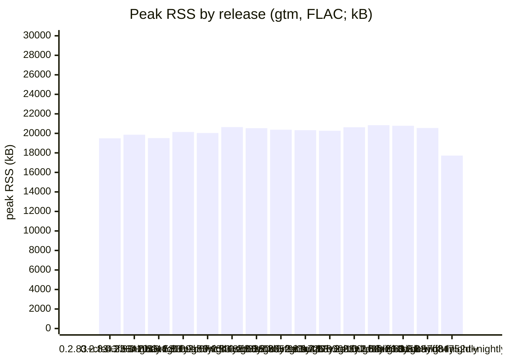
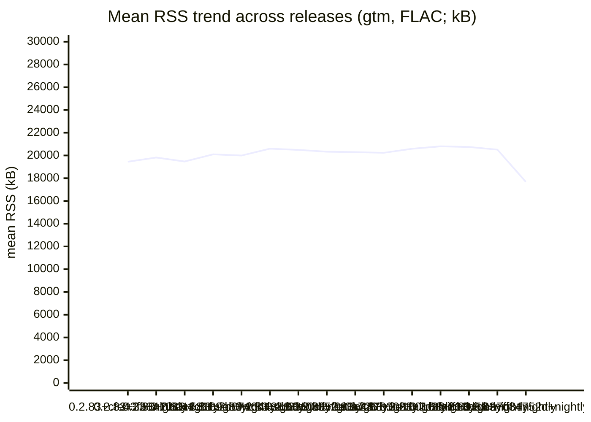
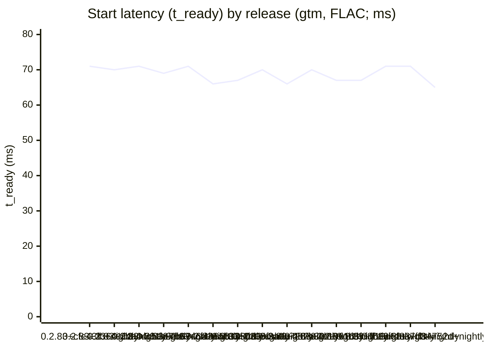

# gtm Benchmarks

Automated measurements of gtm's resource usage during playback, compared
release-over-release and against the reference CLI player **cliamp**
([bjarneo/cliamp](https://github.com/bjarneo/cliamp)).

> **This run**: release `0.2.83+d84752d+nightly` (commit `d84752d432ac19748dfad2fa4b46d6b5a9faa9e2`, 2026-09-14T17:41:14Z).

## Headline — diff vs the last published release (`0.2.83+dca7ff3+nightly`)

| Fixture (player) | Metric | Prev (`0.2.83+dca7ff3+nightly`) | This | Δ |
|------------------|--------|------:|-----:|---:|
| bench.flac (gtm) | peak RSS (kB) | 20548 | 17724 | **−2824** |
| bench.flac (gtm) | mean RSS (kB) | 20514 | 17683 | **−2831** |
| bench.flac (gtm) | CPU (ms) | 130 | 110 | **−20** |
| bench.flac (gtm) | RSS @5s (kB) | 20444 | 17604 | **−2840** |

## Peak RSS by release (gtm, FLAC; kB)

## Mean RSS trend across releases (gtm, FLAC; kB)

## Start latency (t_ready) by release (gtm, FLAC; ms)

## History

| Release | Date | gtm peak RSS (kB) | gtm mean RSS (kB) | gtm t_ready (ms) |
|---------|------|-----:|-----:|-----:|
| 0.2.83+cfe43fb+nightly | 2026-09-08 | 19492 | 19449 | 71 |
| 0.2.83+3364103+nightly | 2026-09-08 | 19860 | 19817 | 70 |
| 0.2.83+0ba44c5+nightly | 2026-09-09 | 19512 | 19469 | 71 |
| 0.2.83+581b9eb+nightly | 2026-09-09 | 20140 | 20097 | 69 |
| 0.2.83+7b6746d+nightly | 2026-09-10 | 20036 | 19993 | 71 |
| 0.2.83+cf44858+nightly | 2026-09-10 | 20640 | 20597 | 66 |
| 0.2.83+ab3350d+nightly | 2026-09-10 | 20532 | 20489 | 67 |
| 0.2.83+0305f9a+nightly | 2026-09-10 | 20376 | 20333 | 70 |
| 0.2.83+3a0a726+nightly | 2026-09-11 | 20328 | 20293 | 66 |
| 0.2.83+487b302+nightly | 2026-09-11 | 20268 | 20233 | 70 |
| 0.2.83+3e10016+nightly | 2026-09-12 | 20628 | 20593 | 67 |
| 0.2.83+1d3fd86+nightly | 2026-09-13 | 20840 | 20805 | 67 |
| 0.2.83+ff13d58+nightly | 2026-09-13 | 20780 | 20746 | 71 |
| 0.2.83+dca7ff3+nightly | 2026-09-14 | 20548 | 20514 | 71 |
| 0.2.83+d84752d+nightly | 2026-09-14 | 17724 | 17683 | 65 |

## Machine-readable history

Past results are stored only in the markers below; `render-bench.sh`
reconstructs trend history from them. Do not edit by hand.

<!--bench:{"tag":"0.2.83+cfe43fb+nightly","date":"2026-09-08T17:55:34Z","commit":"cfe43fbf581ce65bd900879a5883f49d610243e0","seconds":"152","runs":{"gtm/bench.flac":{"file_sha256":"c5e5c960cf59e5fdf3f3b68ea94a24d5f3d4b1122697e4e19d5ec5c1c3e175de","peak_rss_kb":19492,"mean_rss_kb":19449,"rss_5s_kb":19364,"cpu_ms":120,"t_ready_ms":71},"gtm/bench.mp3":{"file_sha256":"6bd083a60ca94245ffd8d1be73e4b83eaab0fb6eeb6648e214ca528563a0bbfd","peak_rss_kb":19924,"mean_rss_kb":19905,"rss_5s_kb":19816,"cpu_ms":210,"t_ready_ms":71}}}-->
<!--bench:{"tag":"0.2.83+3364103+nightly","date":"2026-09-08T20:00:21Z","commit":"336410342811a809587a27820b9d4fcc355237a5","seconds":"154","runs":{"gtm/bench.flac":{"file_sha256":"c5e5c960cf59e5fdf3f3b68ea94a24d5f3d4b1122697e4e19d5ec5c1c3e175de","peak_rss_kb":19860,"mean_rss_kb":19817,"rss_5s_kb":19732,"cpu_ms":120,"t_ready_ms":70},"gtm/bench.mp3":{"file_sha256":"6bd083a60ca94245ffd8d1be73e4b83eaab0fb6eeb6648e214ca528563a0bbfd","peak_rss_kb":19536,"mean_rss_kb":19518,"rss_5s_kb":19428,"cpu_ms":240,"t_ready_ms":70}}}-->
<!--bench:{"tag":"0.2.83+0ba44c5+nightly","date":"2026-09-09T05:31:12Z","commit":"0ba44c500b35a5321172f2929fbf43fd4de64434","seconds":"153","runs":{"gtm/bench.flac":{"file_sha256":"c5e5c960cf59e5fdf3f3b68ea94a24d5f3d4b1122697e4e19d5ec5c1c3e175de","peak_rss_kb":19512,"mean_rss_kb":19469,"rss_5s_kb":19384,"cpu_ms":110,"t_ready_ms":71},"gtm/bench.mp3":{"file_sha256":"6bd083a60ca94245ffd8d1be73e4b83eaab0fb6eeb6648e214ca528563a0bbfd","peak_rss_kb":19540,"mean_rss_kb":19522,"rss_5s_kb":19432,"cpu_ms":210,"t_ready_ms":71}}}-->
<!--bench:{"tag":"0.2.83+581b9eb+nightly","date":"2026-09-09T20:48:19Z","commit":"581b9ebcfa6a146277196701c122bedca782e180","seconds":"154","runs":{"gtm/bench.flac":{"file_sha256":"c5e5c960cf59e5fdf3f3b68ea94a24d5f3d4b1122697e4e19d5ec5c1c3e175de","peak_rss_kb":20140,"mean_rss_kb":20097,"rss_5s_kb":20012,"cpu_ms":120,"t_ready_ms":69},"gtm/bench.mp3":{"file_sha256":"6bd083a60ca94245ffd8d1be73e4b83eaab0fb6eeb6648e214ca528563a0bbfd","peak_rss_kb":20388,"mean_rss_kb":20370,"rss_5s_kb":20280,"cpu_ms":210,"t_ready_ms":70}}}-->
<!--bench:{"tag":"0.2.83+7b6746d+nightly","date":"2026-09-10T06:06:28Z","commit":"7b6746d893eb83d1de2e18e9289c416420bb7b94","seconds":"154","runs":{"gtm/bench.flac":{"file_sha256":"c5e5c960cf59e5fdf3f3b68ea94a24d5f3d4b1122697e4e19d5ec5c1c3e175de","peak_rss_kb":20036,"mean_rss_kb":19993,"rss_5s_kb":19908,"cpu_ms":170,"t_ready_ms":71},"gtm/bench.mp3":{"file_sha256":"6bd083a60ca94245ffd8d1be73e4b83eaab0fb6eeb6648e214ca528563a0bbfd","peak_rss_kb":20856,"mean_rss_kb":20838,"rss_5s_kb":20748,"cpu_ms":290,"t_ready_ms":70}}}-->
<!--bench:{"tag":"0.2.83+cf44858+nightly","date":"2026-09-10T09:49:45Z","commit":"cf44858c93d96f5b91a11c96226e05cd98ec97af","seconds":"152","runs":{"gtm/bench.flac":{"file_sha256":"c5e5c960cf59e5fdf3f3b68ea94a24d5f3d4b1122697e4e19d5ec5c1c3e175de","peak_rss_kb":20640,"mean_rss_kb":20597,"rss_5s_kb":20512,"cpu_ms":100,"t_ready_ms":66,"p50_latency_kb":20640,"p95_latency_kb":20640},"gtm/bench.mp3":{"file_sha256":"6bd083a60ca94245ffd8d1be73e4b83eaab0fb6eeb6648e214ca528563a0bbfd","peak_rss_kb":20776,"mean_rss_kb":20758,"rss_5s_kb":20668,"cpu_ms":180,"t_ready_ms":67,"p50_latency_kb":20776,"p95_latency_kb":20776}}}-->
<!--bench:{"tag":"0.2.83+ab3350d+nightly","date":"2026-09-10T14:10:54Z","commit":"ab3350de96b1e92d1893959d78622819538d8621","seconds":"152","runs":{"gtm/bench.flac":{"file_sha256":"c5e5c960cf59e5fdf3f3b68ea94a24d5f3d4b1122697e4e19d5ec5c1c3e175de","peak_rss_kb":20532,"mean_rss_kb":20489,"rss_5s_kb":20404,"cpu_ms":90,"t_ready_ms":67,"p50_latency_kb":20532,"p95_latency_kb":20532},"gtm/bench.mp3":{"file_sha256":"6bd083a60ca94245ffd8d1be73e4b83eaab0fb6eeb6648e214ca528563a0bbfd","peak_rss_kb":20912,"mean_rss_kb":20883,"rss_5s_kb":20740,"cpu_ms":150,"t_ready_ms":68,"p50_latency_kb":20912,"p95_latency_kb":20912}}}-->
<!--bench:{"tag":"0.2.83+0305f9a+nightly","date":"2026-09-10T20:16:24Z","commit":"0305f9a44dd09c897126ad9bf85be1193dedaaf1","seconds":"152","runs":{"gtm/bench.flac":{"file_sha256":"c5e5c960cf59e5fdf3f3b68ea94a24d5f3d4b1122697e4e19d5ec5c1c3e175de","peak_rss_kb":20376,"mean_rss_kb":20333,"rss_5s_kb":20248,"cpu_ms":120,"t_ready_ms":70,"p50_latency_kb":20376,"p95_latency_kb":20376},"gtm/bench.mp3":{"file_sha256":"6bd083a60ca94245ffd8d1be73e4b83eaab0fb6eeb6648e214ca528563a0bbfd","peak_rss_kb":20712,"mean_rss_kb":20693,"rss_5s_kb":20604,"cpu_ms":220,"t_ready_ms":70,"p50_latency_kb":20712,"p95_latency_kb":20712}}}-->
<!--bench:{"tag":"0.2.83+3a0a726+nightly","date":"2026-09-11T19:36:34Z","commit":"3a0a726f42d9a04bcdd63739cff54b4bf958ab32","seconds":"152","runs":{"gtm/bench.flac":{"file_sha256":"c5e5c960cf59e5fdf3f3b68ea94a24d5f3d4b1122697e4e19d5ec5c1c3e175de","peak_rss_kb":20328,"mean_rss_kb":20293,"rss_5s_kb":20224,"cpu_ms":100,"t_ready_ms":66,"p50_latency_kb":20328,"p95_latency_kb":20328},"gtm/bench.mp3":{"file_sha256":"6bd083a60ca94245ffd8d1be73e4b83eaab0fb6eeb6648e214ca528563a0bbfd","peak_rss_kb":20924,"mean_rss_kb":20906,"rss_5s_kb":20820,"cpu_ms":180,"t_ready_ms":67,"p50_latency_kb":20924,"p95_latency_kb":20924}}}-->
<!--bench:{"tag":"0.2.83+487b302+nightly","date":"2026-09-11T20:00:04Z","commit":"487b302341a10de5ed97b62fe4c34e057e1461f1","seconds":"154","runs":{"gtm/bench.flac":{"file_sha256":"c5e5c960cf59e5fdf3f3b68ea94a24d5f3d4b1122697e4e19d5ec5c1c3e175de","peak_rss_kb":20268,"mean_rss_kb":20233,"rss_5s_kb":20164,"cpu_ms":100,"t_ready_ms":70,"p50_latency_kb":20268,"p95_latency_kb":20268},"gtm/bench.mp3":{"file_sha256":"6bd083a60ca94245ffd8d1be73e4b83eaab0fb6eeb6648e214ca528563a0bbfd","peak_rss_kb":20524,"mean_rss_kb":20506,"rss_5s_kb":20420,"cpu_ms":170,"t_ready_ms":69,"p50_latency_kb":20524,"p95_latency_kb":20524}}}-->
<!--bench:{"tag":"0.2.83+3e10016+nightly","date":"2026-09-12T13:00:32Z","commit":"3e100168e456d29fee2c3cabd7616ff28e646a80","seconds":"152","runs":{"gtm/bench.flac":{"file_sha256":"c5e5c960cf59e5fdf3f3b68ea94a24d5f3d4b1122697e4e19d5ec5c1c3e175de","peak_rss_kb":20628,"mean_rss_kb":20593,"rss_5s_kb":20524,"cpu_ms":90,"t_ready_ms":67,"p50_latency_kb":20628,"p95_latency_kb":20628},"gtm/bench.mp3":{"file_sha256":"6bd083a60ca94245ffd8d1be73e4b83eaab0fb6eeb6648e214ca528563a0bbfd","peak_rss_kb":20764,"mean_rss_kb":20746,"rss_5s_kb":20660,"cpu_ms":150,"t_ready_ms":67,"p50_latency_kb":20764,"p95_latency_kb":20764}}}-->
<!--bench:{"tag":"0.2.83+1d3fd86+nightly","date":"2026-09-13T09:36:04Z","commit":"1d3fd8603feea2f4d393859502fc9cbb62f35c36","seconds":"152","runs":{"gtm/bench.flac":{"file_sha256":"c5e5c960cf59e5fdf3f3b68ea94a24d5f3d4b1122697e4e19d5ec5c1c3e175de","peak_rss_kb":20840,"mean_rss_kb":20805,"rss_5s_kb":20736,"cpu_ms":120,"t_ready_ms":67,"p50_latency_kb":20840,"p95_latency_kb":20840},"gtm/bench.mp3":{"file_sha256":"6bd083a60ca94245ffd8d1be73e4b83eaab0fb6eeb6648e214ca528563a0bbfd","peak_rss_kb":21100,"mean_rss_kb":21082,"rss_5s_kb":20996,"cpu_ms":210,"t_ready_ms":67,"p50_latency_kb":21100,"p95_latency_kb":21100}}}-->
<!--bench:{"tag":"0.2.83+ff13d58+nightly","date":"2026-09-13T10:28:17Z","commit":"ff13d582992fd6b1e3960f08be8b034e5e49d2b2","seconds":"156","runs":{"gtm/bench.flac":{"file_sha256":"c5e5c960cf59e5fdf3f3b68ea94a24d5f3d4b1122697e4e19d5ec5c1c3e175de","peak_rss_kb":20780,"mean_rss_kb":20746,"rss_5s_kb":20676,"cpu_ms":130,"t_ready_ms":71,"p50_latency_kb":20780,"p95_latency_kb":20780},"gtm/bench.mp3":{"file_sha256":"6bd083a60ca94245ffd8d1be73e4b83eaab0fb6eeb6648e214ca528563a0bbfd","peak_rss_kb":20880,"mean_rss_kb":20863,"rss_5s_kb":20776,"cpu_ms":230,"t_ready_ms":71,"p50_latency_kb":20880,"p95_latency_kb":20880}}}-->
<!--bench:{"tag":"0.2.83+dca7ff3+nightly","date":"2026-09-14T11:26:14Z","commit":"dca7ff370954e3b9105392c40d103db69a37600b","seconds":"156","runs":{"gtm/bench.flac":{"file_sha256":"c5e5c960cf59e5fdf3f3b68ea94a24d5f3d4b1122697e4e19d5ec5c1c3e175de","peak_rss_kb":20548,"mean_rss_kb":20514,"rss_5s_kb":20444,"cpu_ms":130,"t_ready_ms":71,"rss_p50_kb":20548,"rss_p95_kb":20548},"gtm/bench.mp3":{"file_sha256":"6bd083a60ca94245ffd8d1be73e4b83eaab0fb6eeb6648e214ca528563a0bbfd","peak_rss_kb":20804,"mean_rss_kb":20787,"rss_5s_kb":20700,"cpu_ms":250,"t_ready_ms":72,"rss_p50_kb":20804,"rss_p95_kb":20804}}}-->
<!--bench:{"tag":"0.2.83+d84752d+nightly","date":"2026-09-14T17:41:14Z","commit":"d84752d432ac19748dfad2fa4b46d6b5a9faa9e2","seconds":"152","runs":{"gtm/bench.flac":{"file_sha256":"c5e5c960cf59e5fdf3f3b68ea94a24d5f3d4b1122697e4e19d5ec5c1c3e175de","peak_rss_kb":17724,"mean_rss_kb":17683,"rss_5s_kb":17604,"cpu_ms":110,"t_ready_ms":65,"rss_p50_kb":17724,"rss_p95_kb":17724},"gtm/bench.mp3":{"file_sha256":"6bd083a60ca94245ffd8d1be73e4b83eaab0fb6eeb6648e214ca528563a0bbfd","peak_rss_kb":17876,"mean_rss_kb":17858,"rss_5s_kb":17768,"cpu_ms":170,"t_ready_ms":66,"rss_p50_kb":17876,"rss_p95_kb":17876}}}-->

## Methodology

- A single representative FLAC and one MP3 (both committed under a sealed
  fixture hash — see `assets/fixtures/` and `gen-fixtures.sh -c`) are played
  for the same window for gtm and cliamp.
- gtm runs through its headless daemon in `--test-mode` (NullMixer, no audio
  device) so CPU/RSS are measured without an audio sink.
- Metrics: peak / mean / at-5s RSS (kB, from `/proc/<pid>/status` `VmRSS`),
  CPU (ms, from `/proc/<pid>/stat` utime+stime), and t_ready (ms, IPC round
  trip to first playing state).
- Harness: `scripts/bench/run-bench.sh <player> <file> <seconds>`; collection:
  `scripts/bench/collect.sh <tag>` writes ephemeral results to `.bench/`; this
  renderer: `scripts/bench/render-bench.sh` publishes them into this file.
