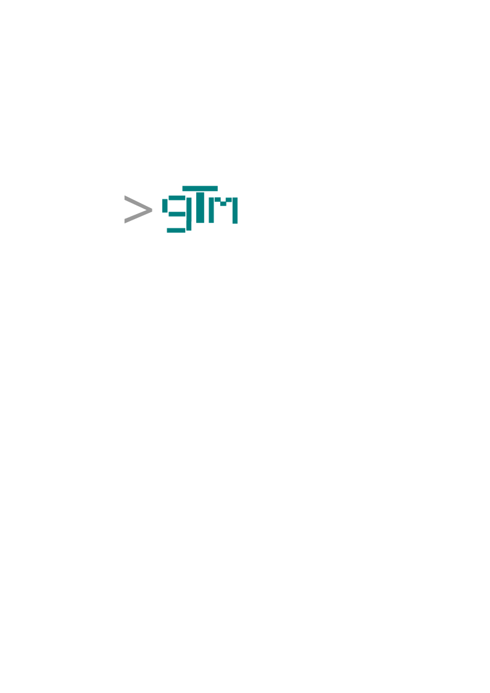

# gtm.rs



[](https://crates.io/crates/gtm)
[](https://crates.io/crates/gtm)
[](https://docs.rs/gtm)
[](https://github.com/prjctimg/gtm.rs/actions/workflows/ci.yml)
[](https://github.com/prjctimg/gtm.rs/blob/main/LICENSE)

A terminal music player with background playback and YouTube/Spotify
integration. Rust implementation of the [gtm spec](https://github.com/prjctimg/gtm.spec).


## Why I built this

I wanted a player that keeps playing in the background while I work in the
terminal, handles local files *and* YouTube/Spotify in one place, and sounds
good through a real EQ instead of a flat toggle. gtm.rs is that.

## Features

- **Background playback**: reattach to the client from anywhere in the terminal
- **YouTube, Spotify, Deezer**: search, download, and resolve tracks, sync
  Spotify playlists, and fetch missing metadata/lyrics/cover art
- **Crossfade**: gapless-ish transitions with duration and easing options,
  picked interactively in the settings UI
- **Lyrics**: automatic fetch from LRCLIB (default provider), syncable
  on-demand via `gtm lyrics` / `gtm metadata sync`
- **Metadata sync**: backfill missing tags, cover art, and lyrics for local
  files from the TUI or the CLI
- **Equalizer**: 16 presets plus per-band gain, headroom stage, and a spectrum
  visualizer
- **Soloist**: Spotify playback bridge via the local `soloist` daemon, with
  optional auto-start
- **Export M3U**: dump the current library or queue to an m3u playlist
- **Sleep timer**: timed shutdown with cancel, settable from the TUI or CLI
- **Cover art**: rendered inline via the kitty/terminal image protocol
- **Zero configuration**: sane defaults, fully customizable via TOML, 16
  built-in themes in Classic and Modern designs, various widget styles
- **Reactive theming**: accent colors extracted from the current track's
  cover art, toggleable in Settings → System
- **MPRIS**: media player controls via D-Bus

## Spotify

- Link your account with an access token from the TUI
  (`Settings → Spotify → Link`); unlink anytime.
- Sync saved playlists into the library and resolve individual Spotify
  tracks: gtm finds a matching YouTube upload and downloads it as a local
  file, so playback works even without the Spotify app running.
- The optional **Soloist** bridge drives real Spotify playback through the
  local `soloist` daemon (requires a Premium account).

## YouTube

- Search YouTube (`yt-dlp` under the hood) and download results straight
  into the library as MP3 with automatic lyrics + metadata backfill.
- **Cookies are required for downloads.** Set `Settings → YouTube → Cookie
  File` to a Netscape-format cookie export (e.g. from a browser extension).
  Without valid cookies YouTube answers extraction requests with HTTP 403;
  every search, resolve, and download path passes the configured cookie
  file to yt-dlp automatically.

## Known gaps

- The daemon-side `yt download/poll/cancel` IPC verbs are stubs; the TUI
  shells out to `yt-dlp` directly for downloads.
- Deezer integration is limited to cover art lookup.
- Soloist is an external component; without it, "Spotify playback" means
  resolving to local/YouTube audio rather than streaming from Spotify.

## Comparison

| | gtm.rs | cmus | mpd + ncmpcpp | spotify-tui | mopidy |
|---|---|---|---|---|---|
| Background daemon | yes | no | yes | no | yes |
| Local files + YouTube/Spotify in one player | yes | no | no | spotify only | addons |
| Equalizer | 16 presets, 15 bands | no | via mpd | no | via addons |
| Terminal UI | TUI + CLI | TUI | TUI | TUI | client needed |
| Inline cover art | yes | no | no | no | no |

## Install

```bash
curl -fsSL https://raw.githubusercontent.com/prjctimg/gtm.spec/main/install.sh | bash -s -- --impl rust
```

### GitHub Release

Each `gtm-{platform}.tar.gz` bundles both binaries (`bin/gtm`, `bin/gtmd`),
man pages, shell completions, and the `systemd` user service. Substitute
`x86_64-linux` for `aarch64-linux`, `aarch64-linux-musl`, `aarch64-darwin` or
`aarch64-android` as needed.

Grab one from the [releases page](https://github.com/prjctimg/gtm.rs/releases/latest).

```bash
curl -fsSLO https://github.com/prjctimg/gtm.rs/releases/latest/download/gtm-x86_64-linux.tar.gz
tar xzf gtm-x86_64-linux.tar.gz
cd gtm-x86_64-linux

sudo install -Dm755 bin/gtm  /usr/local/bin/gtm
sudo install -Dm755 bin/gtmd /usr/local/bin/gtmd
sudo install -Dm644 man/man1/gtm.1 man/man1/gtmd.1 man/man1/gtmd-ipc.1 /usr/local/share/man/man1/
sudo install -Dm644 systemd/gtmd.service /usr/local/lib/systemd/user/gtmd.service
sudo install -Dm644 completions/gtm.bash completions/gtmd.bash /usr/local/share/bash-completion/completions/
sudo install -Dm644 completions/_gtm completions/_gtmd /usr/local/share/zsh/vendor-completions/
sudo install -Dm644 completions/gtm.fish completions/gtmd.fish /usr/local/share/fish/vendor_completions.d/

systemctl --user daemon-reload
systemctl --user enable --now gtmd
```

### Build from Source

Requires Rust 1.81+ and ALSA development headers (`libasound2-dev` on Debian/Ubuntu).

```bash
cargo build --release
sudo make install
```

## Screenshots


## Documentation

- [Wiki](https://github.com/prjctimg/gtm.rs/wiki)
- [gtm.spec](https://github.com/prjctimg/gtm.spec)
- [gtm(1)](docs/man/gtm.1.md)
- [gtmd(1)](docs/man/gtmd.1.md)
- [gtmd-ipc(1)](docs/man/gtmd-ipc.1.md)

## Contributing

This is a hobby project. It is feature complete and stable enough to use as a
daily driver, though still largely a WIP. See [CONTRIBUTING.md](CONTRIBUTING.md)
for build instructions, the crate layout, and the green gates (fmt / clippy /
test). People who have contributed code are listed in
[CONTRIBUTORS.md](CONTRIBUTORS.md).

---

## Acknowledgements

- [color-thief](https://crates.io/crates/color-thief) — median-cut palette
  extraction behind reactive theming
- [rustfft](https://crates.io/crates/rustfft) — FFT backend for the spectrum
  visualizer
- [ratatui](https://ratatui.rs) and
  [ratatui-image](https://crates.io/crates/ratatui-image) — terminal UI and
  inline cover art
- [symphonia](https://crates.io/crates/symphonia),
  [fundsp](https://crates.io/crates/fundsp), and
  [rodio](https://crates.io/crates/rodio) — decoding, EQ/reverb DSP, and
  audio output
- [yt-dlp](https://github.com/yt-dlp/yt-dlp) — YouTube search and extraction
- [LRCLIB](https://lrclib.net) — lyrics provider

(c) 2026 - present, [prjctimg](https://prjctimg.me)

Released under the GPL-3.0 license.
