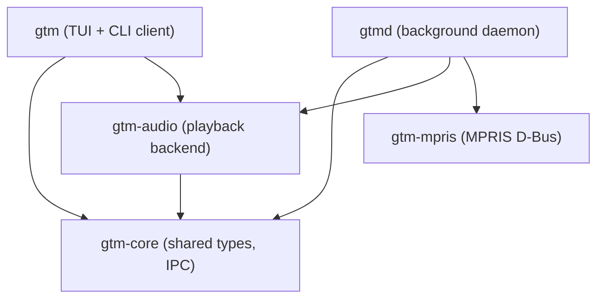
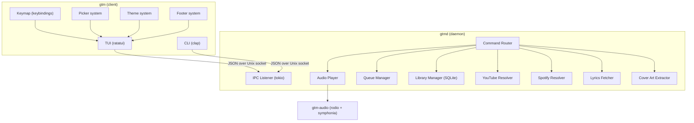
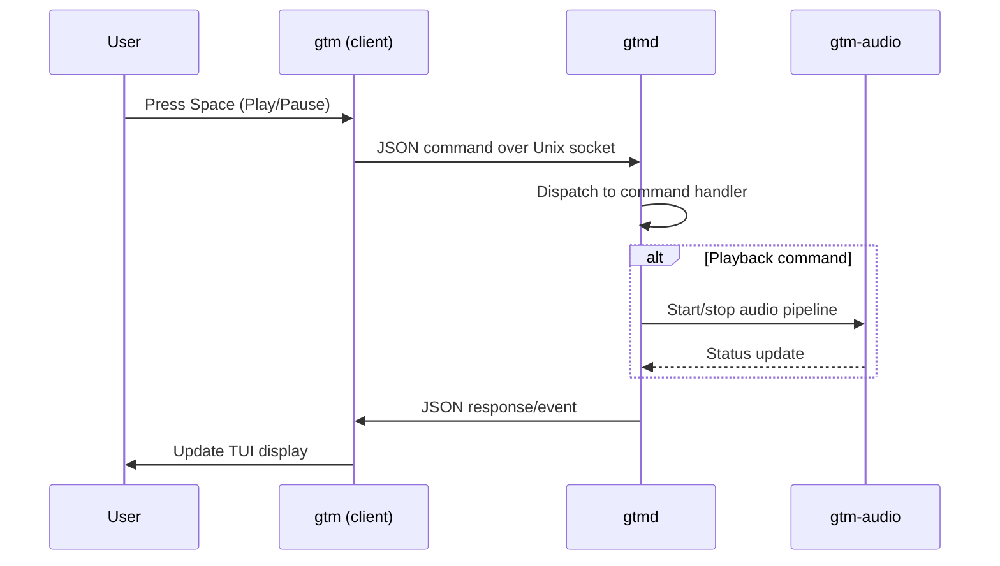
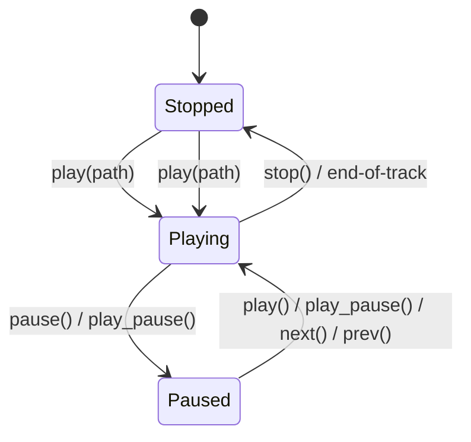
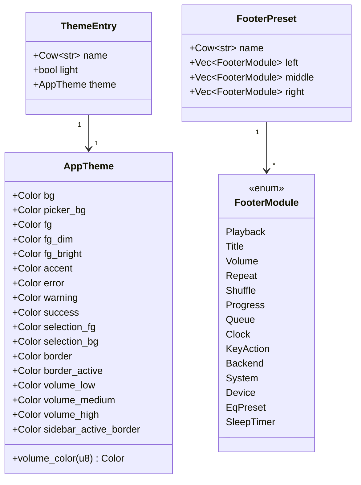

# Architecture

## Crate Dependency Graph

```mermaid
graph TD
    gtm["gtm (TUI + CLI client)"]
    gtmd["gtmd (background daemon)"]
    gtm_core["gtm-core (shared types, IPC)"]
    gtm_audio["gtm-audio (playback backend)"]
    gtm_mpris["gtm-mpris (MPRIS D-Bus)"]

    gtm --> gtm_core
    gtm --> gtm_audio
    gtmd --> gtm_core
    gtmd --> gtm_audio
    gtmd --> gtm_mpris
    gtm_audio --> gtm_core
```

## Component Diagram

```mermaid
flowchart TB
    subgraph Client ["gtm (client)"]
        TUI["TUI (ratatui)"]
        CLI["CLI (clap)"]
        Keymap["Keymap (keybindings)"]
        Picker["Picker system"]
        Theme["Theme system"]
        Footer["Footer system"]
    end

    subgraph Daemon ["gtmd (daemon)"]
        IPC["IPC Listener (tokio)"]
        Router["Command Router"]
        Player["Audio Player"]
        Queue["Queue Manager"]
        Library["Library Manager (SQLite)"]
        YT["YouTube Resolver"]
        SP["Spotify Resolver"]
        Lyrics["Lyrics Fetcher"]
        Cover["Cover Art Extractor"]
    end

    TUI -->|"JSON over Unix socket"| IPC
    CLI -->|"JSON over Unix socket"| IPC
    Keymap --> TUI
    Picker --> TUI
    Theme --> TUI
    Footer --> TUI
    Router --> Player
    Router --> Queue
    Router --> Library
    Router --> YT
    Router --> SP
    Router --> Lyrics
    Router --> Cover
    Player --> gtm_audio["gtm-audio (rodio + symphonia)"]
```

## IPC Communication Flow

```mermaid
sequenceDiagram
    participant User
    participant gtm as gtm (client)
    participant gtmd
    participant Audio as gtm-audio

    User->>gtm: Press Space (Play/Pause)
    gtm->>gtmd: JSON command over Unix socket
    gtmd->>gtmd: Dispatch to command handler
    alt Playback command
        gtmd->>Audio: Start/stop audio pipeline
        Audio-->>gtmd: Status update
    end
    gtmd->>gtm: JSON response/event
    gtm->>User: Update TUI display
```

## Playback State Machine

```mermaid
stateDiagram-v2
    [*] --> Stopped
    Stopped --> Playing : play(path)
    Playing --> Paused : pause() / play_pause()
    Paused --> Playing : play() / play_pause() / next() / prev()
    Playing --> Stopped : stop() / end-of-track
    Stopped --> Playing : play(path)
```

## Theme System

```mermaid
classDiagram
    class AppTheme {
        +Color bg
        +Color picker_bg
        +Color fg
        +Color fg_dim
        +Color fg_bright
        +Color accent
        +Color error
        +Color warning
        +Color success
        +Color selection_fg
        +Color selection_bg
        +Color border
        +Color border_active
        +Color volume_low
        +Color volume_medium
        +Color volume_high
        +Color sidebar_active_border
        +volume_color(u8) Color
    }

    class ThemeEntry {
        +Cow~str~ name
        +bool light
        +AppTheme theme
    }

    class FooterPreset {
        +Cow~str~ name
        +Vec~FooterModule~ left
        +Vec~FooterModule~ middle
        +Vec~FooterModule~ right
    }

    class FooterModule {
        <<enum>>
        Playback
        Title
        Volume
        Repeat
        Shuffle
        Progress
        Queue
        Clock
        KeyAction
        Backend
        System
        Device
        EqPreset
        SleepTimer
    }

    ThemeEntry "1" --> "1" AppTheme
    FooterPreset "1" --> "*" FooterModule
```