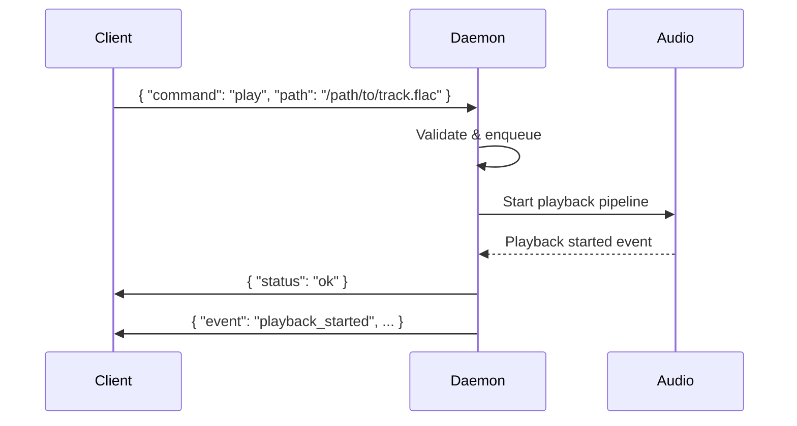

# IPC Protocol

GTM communicates with `gtmd` over a Unix domain socket using JSON-line framing.

## Transport

- **Command socket**: `$XDG_RUNTIME_DIR/gtm/gtmd.sock` (default)
- **Pulse socket**: `$XDG_RUNTIME_DIR/gtm/gtmd-pulse.sock` (when pulseaudio backend is active)

## Framing

- **Commands**: JSON objects sent as single lines (`\n`-delimited)
- **Responses**: JSON objects returned as single lines
- **Events**: JSON objects pushed by the daemon asynchronously
- **Binary data**: MessagePack-encoded for cover art and other binary payloads

## Handshake

On connect, the daemon sends a handshake event with its version and supported protocol version. The client validates compatibility before sending commands.

## Command Flow



## Response Format

```json
{ "status": "ok" }
```

```json
{ "error": "Track not found" }
```

## Event Types

| Event | Description |
|-------|-------------|
| `playback_started` | Track began playing |
| `playback_paused` | Playback paused |
| `playback_resumed` | Playback resumed |
| `playback_stopped` | Playback stopped |
| `track_changed` | New track loaded |
| `queue_changed` | Queue was modified |
| `volume_changed` | Volume updated |
| `shuffle_changed` | Shuffle toggled |
| `repeat_changed` | Repeat mode changed |
| `mute_changed` | Mute toggled |
| `library_updated` | Library scan completed |
| `health_check` | Daemon health response |